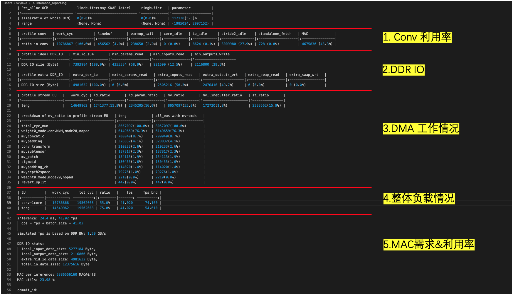
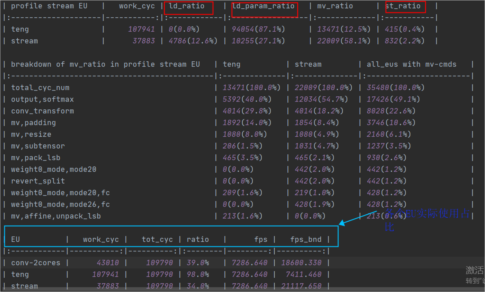

=========================
FAQ 
=========================

-------------------------
Basic Questions
-------------------------

.. data:: If you encounter a problem that cannot be solved for a long time

  If you encounter problems that take a long time to resolve, please contact the relevant ``FAE`` for support. Also note that you should try to use the **latest version** of the toolchain for model conversion.

.. data:: joint Basic model information

    ``joint`` model basic information:
      - Model input ``DType`` of ``tensor`` defaults to ``UINT8`` and ``Layout`` to ``NHWC``.
      - Model output ``DType`` of ``tensor`` defaults to ``FLOAT32``, ``Layout`` is ``NCHW``.
      - ``ColorSpace``: defaults to ``TENSOR_COLOR_SPACE_AUTO``, which can be automatically recognized based on the model input ``channel`` number
          - 3-channel: ``BGR``
          - 1-channel: ``GRAY``
          - Other options: ``RGB``, ``NV12``, ``NV21``, ``BGR0``

.. data:: If you need to change the VNPU settings, you need to recompile, but you can't change the VNPU settings directly through the existing joint

  It is not technically possible to change the ``vnpu`` settings directly from the ``joint`` model, because:
  
  1. the toolchain needs to compile the model based on the input configuration information during compilation, and compilation is to gradually turn the initial model into binary instruction code, which requires a lot of raw information of the model
  
  2. compilation is a continuous ``lowering`` process, which will lose information, and the compiled binary instruction code cannot recover the original model information.
  
  3. besides, different ``vnpu`` configurations will use different hardware resources and compile different optimal binary models
  
  In summary, if you need to modify the ``vnpu`` model, you need to do the conversion again.

.. data:: Detection model has OutOfMemory(OOM) error during conversion, how to solve it

  If the output ``layout`` of the detection model is ``NCHW``, the error ``OOM`` will appear, which is
  This is because ``NPU`` outputs ``layout`` as ``NHWC`` by default, and the ``featuremap`` output by the detection model is larger, 
  The ``transpose`` output of the model is large, so it is easy to crowd the memory when directly ``transpose``. Therefore, you need to specify the output ``layout`` when detecting the model transformation:

  .. code-block:: bash

    pulsar build --input xxx.onnx --config xxx.prototxt --output xxx.joint --output_tensor_layout nhwc

.. data:: How to check NPU utilization rate

  ``ssh`` After logging into the board, use the following code to view it:

  ... code-block:: bash

    $ cd /proc/ax_npu
    $ echo 1 > enable
    # Echo 1 > /proc/ax_proc/ax_npu/enable
    $ cat top_period_ms

.. data:: What is the difference between --config and --output_config for pulsar build

  ``--config`` is a user-friendly ``prototxt`` that provides a variety of syntactic sugar to simplify configuration

  ``--output_config`` expands all syntax sugars and saves them as toolchain-friendly configuration files
  
  At this stage, the ``pulsar run`` emulation function requires the use of ``--output_config`` generated configuration files

.. data:: The simulated fps output in pulsar build differs significantly from the measured fps on the board.

  There are two general reasons for the discrepancy, which are model specific
  
    - ``neu fps`` is larger because the ``DDR`` on the board is not limited, while the ``pulsar`` simulation is strictly stuck on the ``DDR`` bandwidth
    - The smaller ``neu fps`` is due to the fact that in the ``Cycle Model`` of the ``Pulsar`` simulation, the small amount previously omitted (e.g., ``LUT`` configuration time) becomes non-negligible in some ``cases``.

.. data:: How to configure multiple Batches in Prototxt

  The following configuration allows you to set the target ``batch_size`` value independently.

  .. code-block:: bash

    # Path to configuration file parameters: pulsar_conf
    pulsar_conf {
      batch_size: 2 # Set the batch size to 2 for compiling model inference
    }

.. data:: How to configure dynamic Batch in Prototxt

  Dynamic ``Batch`` can be implemented by the following configuration.

  .. code-block:: bash

    # Configuration file parameter path: pulsar_conf
    pulsar_conf {
      batch_size_option: BSO_DYNAMIC # The compiled model supports dynamic batch
      batch_size: 1 # Commonly used for practical inference batch_size
      batch_size: 2 # Commonly used for practical inference batch_size
      batch_size: 4 # The maximum batch_size is 4
    }

  For a more detailed description, see :ref:`pulsar_conf <pulsar_conf>`.

.. data:: onnx model input is RGB, expect the joint model to be converted to RGB input as well, how should this work?

  Configure it in the configuration file as follows: 

  .. code-block:: bash

    dst_input_tensors {
      color_space: TENSOR_COLOR_SPACE_RGB
    }

.. data:: Can the transferred .joint model run on the board like the previous .neu model?

  ``.joint`` can run on the board just like ``.neu``. In fact, the ``.joint`` model is the current mainstream on-board model format and the ``.neu`` model is the old format, ``Pulsar`` can convert the ``.neu`` model to the ``.joint`` model

.. data:: Can PTQ run GPUs?

  The toolchain itself supports it, but ``docker`` itself doesn't use the ``nvidia`` base image for size reasons

.. data:: dataset_output_type defaults to BGR, does it mean that the input to the model is in BGR format when using the image correction from the dataset. If so, should the mean and std in config.prototxt also be set in BGR order?

  Yes, they need to be configured in that order. The ``dataset_output_type`` value is ``BGR`` which means that the calibration images are read in ``BGR`` format at compile time, so ``mean/std`` has to be set in BGR order as well.

.. data:: How to configure the Q value in config.prototxt

  This can be done with the following configuration.

  .. code-block:: bash

    dst_output_tensors {
      data_type: INT16
    }

.. data:: Is the Q value int16?

  ``Q`` values are not exactly ``int16``. The ``Q`` value types can be matched, see :ref:`data_type type <data_type>` for details.

.. data:: How to calculate CPU subgraph time for Q values

  The ``Q`` value does not have a ``CPU`` subgraph, but the ``/Q`` arithmetic operation is left to the client's post-processing code

.. data:: The Q value still has to be connected to the CPU to do the division, which doesn't save time

  Yes, you have to connect to the ``CPU``, but the ``/Q`` operation can be coupled with other operations, and in most cases it is almost free

  For example, if you need to divide after the detection post-processing step ``NMS``, then ``Divisor*Q`` is sufficient

  The detection network alone does a large ``tensor`` multiplication, which may take ``NPU`` several times as long, and ``NMS`` after a small computation

.. data:: what is the Q-value interface for the transfer model

  directly **upboard execution** ``run_joint model.joint``, which will be printed in the log

  The ``C++`` interface in the ``joint sdk`` also has ``nQuantizationValue``.

.. data:: Does the toolchain and hardware support sparse acceleration?

  Structured sparsity and low bit-width are supported, unstructured sparsity is not supported by hardware.

------------------------------------------------------------
View the Inference Report report
------------------------------------------------------------

According to ``inference_report`` can:

  - Analyze inference bottlenecks: ``CONV``, ``DDR``, ``DMA``, ``arithmetic``
  - Count the sources of arithmetic power loss
  - Evaluate the space for continued optimization
  - Analyze the direction of speed optimization

After the ``pulsar build`` command is run, an ``inference_report`` folder is saved in the current working directory,

  - This folder contains one or more ``part_x.lava`` folders (where ``x`` represents the number, starting from ``0``),
  - Each ``part_x.lava`` folder contains an ``inference_report.log`` file,
  - For small models there is usually only one ``part_0.lava`` folder and one ``inference_report.log``, 
  - When the model is too large, it is split into multiple sub-models and executed sequentially, so that there are multiple ``part_0.lava`` folders.

In this case, the ``tot_cyc`` of this model is the sum of the ``tot_cyc`` of these individual submodels, and the ``DDR`` 
The ``total_io_data_size`` is the sum of the ``total_io_data_size`` of these individual submodels.

.. code-block:: sh

  # Smaller model, contains only the part_0.lava folder
  ➜  DEMO cd inference_report
  ➜  inference_report tree -L 2
  .
  └── part_0.lava
      ├── inference_report.log
      ├── subgraph_0
      ├── subgraph_1
      ├── subgraph_2
      ├── subgraph_3
      ├── subgraph_4
      └── subgraph_5

  7 directories, 1 file

View ``inference_report.log`` , the example is as follows:

``inference_report.log`` contains some custom terms, some of which are explained below **Nomenclature**

- ``ld``, i.e. read from ``DDR``, write to ``OCM``
- ``st``, read from ``OCM``, write to ``DDR``
- ``mv``, read from ``OCM``, write to ``OCM``

The role of ``inference_report.log`` is illustrated by a typical example, as in the following ``case``:

In the non-virtual ``NPU`` condition, as shown in the figure (blue box above), three types of ``EU`` are involved in model inference, namely ``conv-2cores``, ``teng`` and ``stream``, 
and the table counts the ``cycle`` percentage, physically meaning the ``cycle`` actually run for each type of ``EU`` divided by the total ``cycle`` actually spent on model inference. This ``ratio`` provides a visual representation of how busy ``EU`` is, 
For example, the ``ratio`` of ``teng`` in the figure reaches ``98%``, which is almost at full capacity.

``teng`` and ``stream`` have the ability to read and write data on ``DDR``. A detailed breakdown of the proportion of each type of task is shown in the ``profile stream EU``, 
The values of ``ld_ratio/ld_param_ratio/st_ratio`` (red box above) reflect the time and percentage of ``DDR`` read/write tasks performed by the corresponding ``EU``, which can be used to analyze the ``DDR`` bandwidth pressure.

**Summary**

In general, the following conditions reflect the speed bottleneck of the model for a given ``DDR_BW`` case:

  - The ``ratio`` of ``teng/stream`` is higher and significantly higher than the ``ratio`` of other ``EU``
  - ``ld_ratio/ld_param_ratio/st_ratio`` is higher in ``teng/stream``

Conversely, the following condition reflects that the speed bottleneck of the model is the computational power:

  - The ``ratio`` of ``conv`` is higher than the ``ratio`` of the other ``EU``s, and significantly higher than the ``ratio`` of the other ``EU``.

More specifically, the ``ratio`` of the model ``teng`` is ``98%``, which is significantly higher than the ``conv``'s ``39.0%``; 
The ``DDR`` read-write task in ``teng`` is ``87.1% + 0.4% = 87.5%`` of the time, which accounts for the majority of the ``EU`` work time, so the speed bottleneck of this model is considered to be the ``DDR`` bandwidth.

... hint::

  For the virtual ``NPU111``, there are only two ``EU``s, ``conv-1core/teng``, which are counted in the same way as the non-virtual ``NPU``.