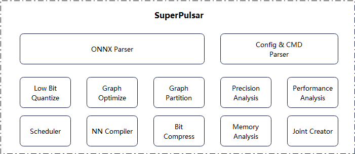
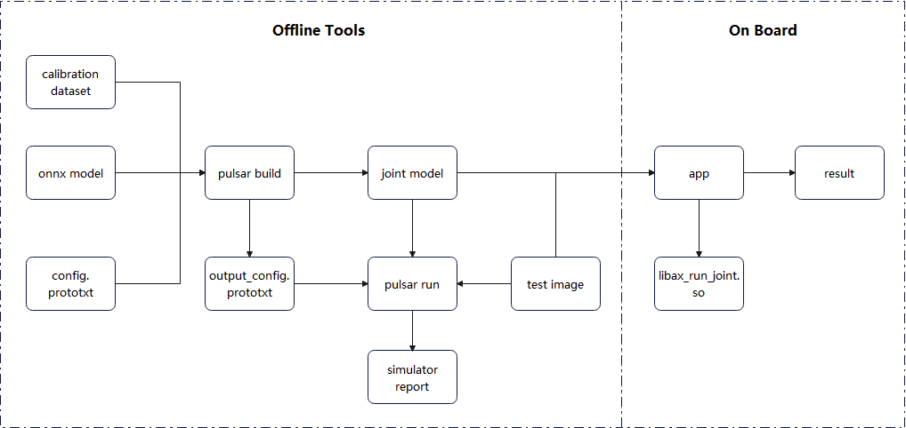

========================================
Pulsar Toolchain Overview
========================================

----------------------------
Introduction
----------------------------

**Pulsar** is an ``all-in-one`` neural network compiler developed by `Irisoft <https://www.axera-tech.com/>`_ **self-developed**, 
It is a quadruple-play of **conversion**, **quantization**, **compilation**, and **heterogeneous** to achieve **fast** and **efficient** deployment of deep learning neural network models. 
We have optimized the features of `AX6` series chips to fully utilize the computing power of on-chip heterogeneous computing units (CPU+NPU) and improve the efficiency of neural network model deployment.

The core function of the ``Pulsar`` toolchain is to compile ``.onnx`` models into ``.joint`` models that can be parsed and run by the chip.

**Architectural diagram**

**Deployment Process**

.. _soc_introduction:

----------------------------
Virtual NPU Introduction
----------------------------

``AXera`` currently provides ``AX630A``, ``AX620A``, and ``AX620U`` available chips, and the following is a brief description of the virtual NPU hardware configuration information for these chips.

~~~~~~~~~~~~~~~~~~~~~~~~~~~~
AX630A
~~~~~~~~~~~~~~~~~~~~~~~~~~~~

**Virtual NPU (Neural-network Processing Unit)**

+-------+------------+
| Mode  |Support List|
+=======+============+
|DEFAULT|0           |
+-------+------------+
|2_2    |221、222    |
+-------+------------+
|3_1    |311、312    |
+-------+------------+

.. note::

    | Only one mode can be selected for ``NPU`` hardware initialization
    | ``DEFAULT`` mode: no division of ``NPU`` resources, use all ``NPU`` resources
    | ``2_2`` mode: divide ``NPU`` resources in half, use half of ``NPU`` resources for ``221`` and ``222`` each
    | ``3_1`` mode: unequal division of NPU resources, ``311`` mode has roughly three times as many resources as ``312``
    | Virtual ``NPU`` mode, you can run ``PTQ`` and ``AI-ISP`` models at the same time

~~~~~~~~~~~~~~~~~~~~~~~~~~~~
AX620A
~~~~~~~~~~~~~~~~~~~~~~~~~~~~

**Virtual NPU**

+---------+--------------+
| Mode    | Support List |
+=========+==============+
| DEFAULT | 0            |
+---------+--------------+
| 1_1     | 111、112     |
+---------+--------------+

.. note::

    | Only one mode can be selected for ``NPU`` hardware initialization
    | ``DEFAULT`` mode: no division of ``NPU`` resources, use all ``NPU`` resources
    | ``1_1`` mode: divide ``NPU`` resources in half, ``111`` and ``112`` each use half of ``NPU`` resources
    | With virtual ``NPU`` mode, you can run ``PTQ`` and ``AI-ISP`` models simultaneously

~~~~~~~~~~~~~~~~~~~~~~~~~~~~
AX620U
~~~~~~~~~~~~~~~~~~~~~~~~~~~~

The ``AX620U`` is the same as the ``AX620A`` in terms of the above functions.
