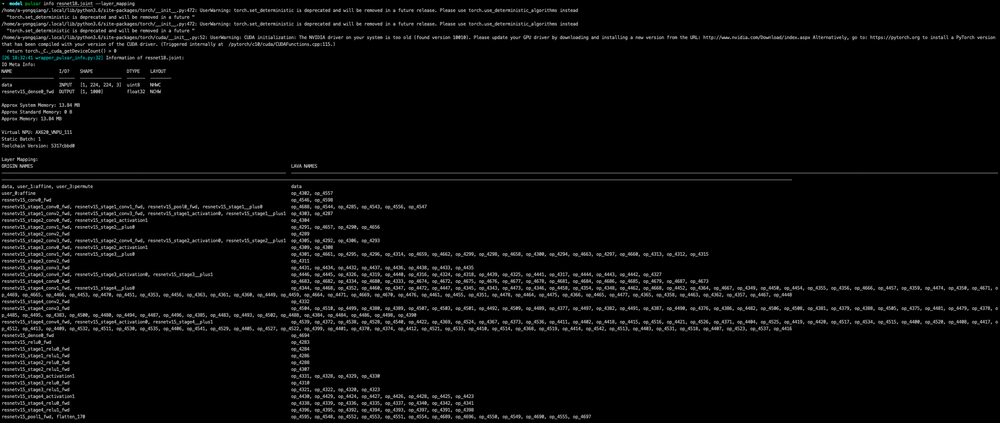
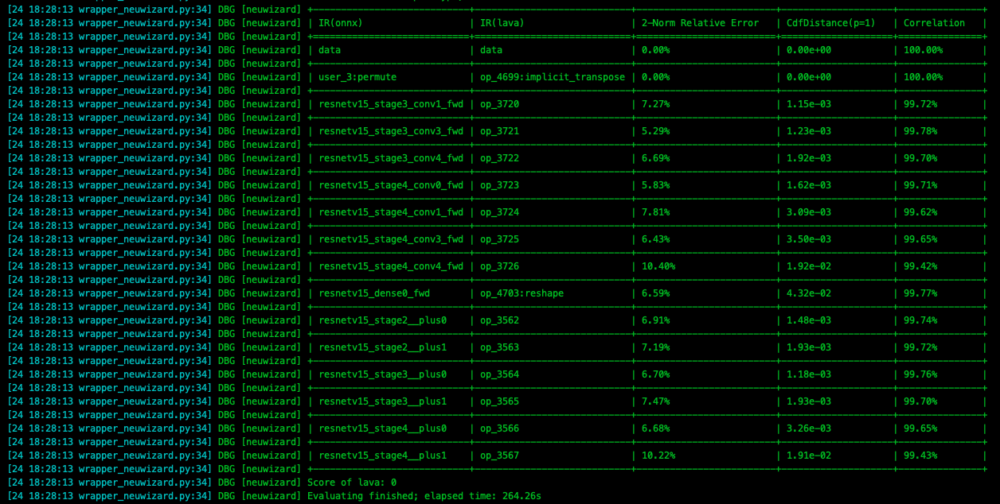
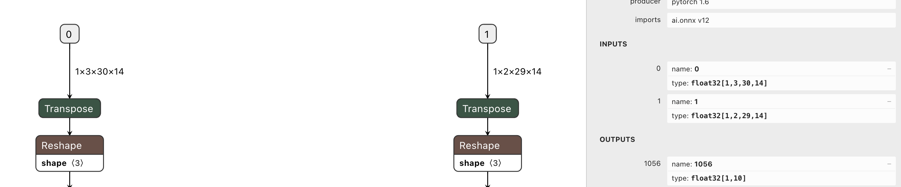

======================================
Model Conversion Advanced Guide
======================================

----------------------------------------------
Pulsar Build model compilation
----------------------------------------------

This section describes the complete use of the ``pulsar build`` command. 

~~~~~~~~~~~~~~~~
Overview
~~~~~~~~~~~~~~~~

``pulsar build`` is used for model optimization, quantization, compilation, and other operations. A diagram of its operation is shown below: 

.. mermaid::

  graph LR;
  Input model [input model onnx] --> pb(pulsar build +command line arguments)
  Configuration file [config.prototxt] --> pb
  pb --> output model [output model joint]
  pb --> output configuration file [configuration file output_config.prototxt]

``pulsar build`` takes the input model (``model.onnx``) and the configuration file (``config.prototxt``) and compiles them to get the output model (``joint``) and the output configuration file (``output_config.prototxt``). 

The command line arguments of ``pulsar build`` will override some parts of the configuration file and cause ``pulsar build`` to output the overwritten configuration file. See :ref:`Configuration file details <config_details>` for a detailed description of the configuration file. 

``pulsar build -h`` shows detailed command line arguments: 

.. code-block:: python
  :name: pulsar_build_help
  :linenos:

  root@xxx:/data# pulsar build -h
  usage: pulsar build [-h] [--config CONFIG] [--output_config OUTPUT_CONFIG]
                      [--input INPUT [INPUT ...]] [--output OUTPUT [OUTPUT ...]]
                      [--calibration_batch_size CALIBRATION_BATCH_SIZE]
                      [--compile_batch_size COMPILE_BATCH_SIZE [COMPILE_BATCH_SIZE ...]]
                      [--batch_size_option {BSO_AUTO,BSO_STATIC,BSO_DYNAMIC}]
                      [--output_dir OUTPUT_DIR]
                      [--virtual_npu {0,311,312,221,222,111,112}]
                      [--input_tensor_color {auto,rgb,bgr,gray,nv12,nv21}]
                      [--output_tensor_color {auto,rgb,bgr,gray,nv12,nv21}]
                      [--output_tensor_layout {native,nchw,nhwc}]
                      [--color_std {studio,full}]
                      [--target_hardware {AX630,AX620,AX170}]
                      [--enable_progress_bar]

  optional arguments:
    -h, --help            show this help msesage and exit
    --config CONFIG       .prototxt
    --output_config OUTPUT_CONFIG
    --input INPUT [INPUT ...]
    --output OUTPUT [OUTPUT ...]
    --calibration_batch_size CALIBRATION_BATCH_SIZE
    --compile_batch_size COMPILE_BATCH_SIZE [COMPILE_BATCH_SIZE ...]
    --batch_size_option {BSO_AUTO,BSO_STATIC,BSO_DYNAMIC}
    --output_dir OUTPUT_DIR
    --virtual_npu {0,311,312,221,222,111,112}
    --input_tensor_color {auto,rgb,bgr,gray,nv12,nv21}
    --output_tensor_color {auto,rgb,bgr,gray,nv12,nv21}
    --output_tensor_layout {native,nchw,nhwc}
    --color_std {studio,full}
                          only support nv12/nv21 now
    --target_hardware {AX630,AX620,AX170}
                          target hardware to compile
    --enable_progress_bar

.. hint::

  Complex functions can be implemented using configuration files, and command-line arguments only play a supporting role. In addition, the command line parameters override some of the corresponding configuration in the configuration file.

~~~~~~~~~~~~~~~~~~~~~~~~~~~~~~~~~~~~~~~~~~~~~~~~~~~~~~~~~~~~~~~~
Detailed explanation of parameters
~~~~~~~~~~~~~~~~~~~~~~~~~~~~~~~~~~~~~~~~~~~~~~~~~~~~~~~~~~~~~~~~

.. data:: pulsar build Parameter explanation

  --input
    
    The input model path for this compilation, corresponding to the :ref:`input_path field <input_path>` in ``config.prototxt``

  --output
  
    Specify the file name of the output model, e.g. ``compiled.joint``, corresponding to :ref:`output_path field <output_path>` in ``config.prototxt``

  --config
  
    Specifies the basic configuration file used to guide the compilation process. If command-line arguments are specified for the ``pulsar build`` command, the values specified in the command-line arguments will be used in preference to those specified in the conversion model

  --output_config
  
    Outputs the complete configuration information used in this build to a file

  --target_hardware
  
    Specify the hardware platform for compiling the output model, currently ``AX630`` and ``AX620`` are available

  --virtual_npu
  
    Specify the virtual NPU to be used for inference, please differentiate according to the ``-target_hardware`` parameter. See the virtual NPU section in :ref:`chip_introduction <soc_introduction>` for details

  --output_dir
  
    Specifies the working directory for the compilation process. The default is the current directory

  --calibration_batch_size
  
    The ``batch_size`` of the data used for internal parameter calibration in the transcoding process. The default value is ``32``.

  --batch_size_option
    
    Sets the ``batch`` type supported by the ``joint`` format model:

      - ``BSO_AUTO``: default option, static by default ``batch``
      - ``BSO_STATIC``: static ``batch``, fixed ``batch_size`` during inference, optimal performance
      - ``BSO_DYNAMIC``: dynamic ``batch``, supports arbitrary ``batch_size`` up to the maximum value when reasoning, most flexible

  --compile_batch_size
  
    Sets the ``batch size`` supported by the ``joint`` format model. The default is ``1``.

      - When ``-batch_size_option BSO_STATIC`` is specified, ``batch_size`` indicates the unique ``batch size`` that the ``joint`` format model can use for reasoning.
      - When ``-batch_size_option BSO_DYNAMIC`` is specified, ``batch_size`` indicates the maximum ``batch size`` that can be used for ``joint`` format model inference.

  --input_tensor_color

    Specify the color space of **input data** for **input model**, optional:

      - Default option: ``auto``, automatic recognition based on the number of input channels to the model
          * 3-channel is ``bgr``
          * 1-channel is ``gray``
      - Other options: ``rgb``, ``bgr``, ``gray``, ``nv12``, ``nv21``

  --output_tensor_color

    Specify the color space of the **input data** for the **output model**, optional:

      - Default option: ``auto``, automatic recognition based on the number of input channels to the model
          * 3-channel is ``bgr``
          * 1-channel is ``gray``
      - Other options: ``rgb``, ``bgr``, ``gray``, ``nv12``, ``nv21``

  --color_std

    Specify the conversion standard to be used when converting between ``RGB`` and ``YUV``, options: ``legacy``, ``studio`` and ``full``, default is ``legacy``

  --enable_progress_bar

    Show progress bar at compile time. Not shown by default
  
  --output_tensor_layout

    Specify the ``layout`` of the **output** model of the ``tensor``, optional:

      - ``native``: default option, legacy option, not recommended. It is recommended to explicitly specify the output ``layout``
      - ``nchw``
      - ``nhwc``
    
    .. attention::
    
      This parameter is only supported by ``axera_neuwizard_v0.6.0.1`` and later toolchains. 
      Starting from ``axera_neuwizard_v0.6.0.1``, the default ``layout`` of the output ``tensor`` of some ``AX620A`` models may be different from the default ``layout`` of the ``axera_neuwizard_v0.6.0.1``. 
      may differ from the model compiled from the toolchain of previous versions of ``axera_neuwizard_v0.6.0.1``. The default ``layout`` of the ``AX630A`` model is not affected by the toolchain version

Code examples

.. code-block::
  :linenos:

  pulsar build --input model.onnx --output compiled.joint --config my_config.prototxt --target_hardware AX620 --virtual_npu 111 --output_config my_output_config.prototxt

.. tip::

  When generating ``joint`` models that support dynamic ``batch``, multiple common ``batch_size`` can be specified after ``-compile_batch_size`` to improve performance when reasoning with ``batch size`` up to these values. 
  
.. attention::

  Specifying multiple ``batch sizes`` will increase the size of the ``joint`` model file.

.. _pulsar_run:

-------------------------------------------------------
Pulsar Run model simulation and alignment
-------------------------------------------------------

This section describes the complete use of the ``pulsar run`` command.

~~~~~~~~~~~~~~~~~
Overview
~~~~~~~~~~~~~~~~~

``pulsar run`` is used to perform **x86 simulation** and **precision pair splitting** of ``joint`` models on the ``x86`` platform.

.. mermaid::

  graph LR;
  Target Model[Target Model joint] --> pulsar_run(pulsar run +command line parameter)
  Reference Model [Reference Model onnx] --> pulsar_run
  Image files [Image files jpg / png] --> pulsar_run
  pulsar_run --> pair splitting result
  pulsar_run --> gt[Simulation of target model inference results + input data on board]

``pulsar run -h`` shows detailed command line arguments:

.. code-block:: python
  :name: input_conf_items
  :linenos:

  root@xxx:/data# pulsar run -h
  usage: pulsar run [-h] [--use_onnx_ir] [--input INPUT [INPUT ...]]
                    [--layer LAYER [LAYER ...]] [--output_gt OUTPUT_GT]
                    [--config CONFIG]
                    model [model ...]

  positional arguments:
    model

  optional arguments:
    -h, --help                   show this help msesage and exit
    --use_onnx_ir                use NeuWizard IR for refernece onnx
    --input INPUT [INPUT ...]    input paths or .json
    --layer LAYER [LAYER ...]    input layer namse
    --output_gt OUTPUT_GT        save gt data in dir
    --config CONFIG

.. data:: pulsar run Parameter explanation

  **Required parameters**
  
    ``model.joint`` ``model.onnx``

  --input

    Multiple input data can be specified and used as input data for the simulation ``inference``. Support ``jpg``, ``png``, ``bin``, etc., and make sure the number of them is the same as the number of model input layers
  
  --layer

    | Not required
    | When the model has multiple inputs, it is used to specify which layer the input data should be on. The order is in contrast to ``-input``.
    | For example, ``-input file1.bin file2.bin --layer layerA layerB`` means input ``file1.bin`` to ``layerA`` and input ``file2.bin`` to ``layerB``, making sure that the length of ``-layer`` is the same as the length of ``-input``.
  
  --use_onnx_ir

    | This option tells ``pulsar run`` to internally infer the ``onnx`` model with ``NeuWizard IR`` when using the ``onnx`` format model as a counterpoint reference model. By default, ``NeuWizard IR`` is not used.
    | This option is only meaningful if `` --onnx`` is specified, it can be ignored

  --output_gt

    Specifies the directory where the simulation ``inference`` results of the target model and the upper board input data are stored. No output by default

  --config
  
    Specifies a configuration file to guide ``pulsar run`` in the internal conversion of the reference model. The configuration file is generally output using the ``-pulsar build`` ``--output_config`` option

``pulsar run`` code example

.. code-block:: python

  pulsar run model.onnx compiled.joint --input test.jpg --config my_output_config.prototxt --output_gt gt

------------------------------------------------------
Pulsar Info View model information
------------------------------------------------------

.. Attention::

  Note: The ``pulsar info`` feature will only work with ``docker`` toolchains with version numbers greater than ``0.6.1.2``.

  For ``.joint`` models transferred from an old toolchain, the correct information cannot be seen with ``pulsar info`` and needs to be reconverted with a newer toolchain. The reason is that the ``Performance.txt`` file in the old ``joint`` does not contain the ``onnx layer name`` information and needs to be reconverted.

``pulsar info`` is used to view information about ``onnx`` and ``joint`` models, and supports saving model information to ``html``, ``grid``, ``jira`` formats.

**Usage commands**

.. code-block:: bash

  pulsar info model.onnx/model.joint

**Parameter list**

.. code-block:: bash

  $ pulsar info -h

  usage: pulsar info [-h] [--output OUTPUT] [--output_json OUTPUT_JSON]
                    [--layer_mapping] [--performance] [--part_info]
                    [--tablefmt TABLEFMT]
                    model

  positional arguments:
    model

  optional arguments:
    -h, --help            show this help msesage and exit
    --output OUTPUT       path to output dir
    --output_json OUTPUT_JSON
    --layer_mapping
    --performance
    --part_info
    --tablefmt TABLEFMT   possible formats (html, grid, jira, etc.)

**Parameter description**

.. data:: pulsar info Parameter explanation

  --output

    Specify the directory where the model information is saved, not saved by default

  --output_json

    Save the full model information as Json, not saved by default

  --layer_mapping

    Show layer_mapping information of Joint model, not shown by default
    
    Can be used to see the correspondence between onnx layer and the converted lava layer

  --performance

    Show performance information of Joint model, not shown by default

  --parts

    Displays all information about each part of the Joint model, not shown by default

  --tablefmt

    Specify the format for displaying and saving model information, optional:
      * simple: DEFAULT
      * grid
      * html
      * jira
      * ... Any of the tablefmt formats supported by the tabulate library

**Example: View basic model information**

.. code-block:: bash

  pulsar info resnet18.joint

  # output log
  [24 18:40:10 wrapper_pulsar_info.py:32] Information of resnet18.joint:
  IO Meta Info:
  NAME                  I/O?    SHAPE             DTYPE    LAYOUT
  --------------------  ------  ----------------  -------  --------
  data                  INPUT   [1, 224, 224, 3]  uint8    NHWC
  resnetv15_dense0_fwd  OUTPUT  [1, 1000]         float32  NCHW

  Approx System Memory: 13.84 MB
  Approx Standard Memory: 0 B
  Approx Memory: 13.84 MB

  Virtual NPU: AX620_VNPU_111
  Static Batch: 1
  Toolchain Version: dfdce086b

**Example: See the correspondence between the onnx layer and the layer of the compiled model**

where ``ORIGIN_NAmse`` is the ``layer name`` of the original ``onnx``, and ``LAVA_NAmse`` is the ``layer name`` of the compiled model.

.. note::

  Specify the parameters in ``pulsar info``:

  - ``--layer_mapping`` parameter to see the correspondence between ``onnx_layer_name`` and the ``layer_name`` of the transformed model
  - The ``--performance`` parameter allows you to see the ``performance`` information for each ``layer``.

-------------------------------------------------
Pulsar Version View Toolchain Version
-------------------------------------------------

``pulsar version`` is used to get the tool version information.

.. hint::

  If you need to provide us with toolchain error information, please submit the version of the toolchain you are using along with the information.

Code examples

.. code-block:: bash

  pulsar version

Example result

.. code-block:: bash

  0.5.34.2
  7ca3b9d5

--------------------------
Tools
--------------------------

The ``Pulsar`` toolchain also provides other common network model processing tools, which help users to format the network model and other functions.

~~~~~~~~~~~~~~~~~~
Caffe2ONNX
~~~~~~~~~~~~~~~~~~

The ``dump_onnx.sh`` tool is pre-installed in the ``Docker`` image of ``Pulsar``, providing the ability to convert ``Caffe`` models to ``ONNX`` models, thus indirectly extending ``pulsar build`` support for ``Caffe`` models. This is done as follows: 

``dump_onnx.sh -h`` to display detailed command line arguments: 

.. code-block:: bash
  :name: dump_onnx_sh
  :linenos:

  root@xxx:/data$ dump_onnx.sh
  Usage: /root/caffe2onnx/dump_onnx.sh [prototxt] [caffemodel] [onnxfile]

Option explanation

- **[prototxt]**

  The path to the ``*.prototxt`` file of the input ``caffe`` model
  
- **[caffemodel]**

  The path to the ``*.caffemodel`` file for the input ``caffe`` model

- **[onnxfile]**

  The output ``*.onnx`` model file path

Code examples

.. code-block:: shell
  :name: dump_onnx_demo
  :linenos:

  root@xxx:/data$ dump_onnx.sh model/mobilenet.prototxt model/mobilenet.caffemodel model/mobilenet.onnx

A sample log message is as follows

.. code-block:: bash
  :name: dump_onnx_log
  :linenos:

  root@xxx:/data$ dump_onnx.sh model/mobilenet.prototxt model/mobilenet.caffemodel model/mobilenet.onnx
  2. start model conversion
  =================================================================
  Converting layer: conv1 | Convolution
  Input:  ['data']
  Output:  ['conv1']
  =================================================================
  Converting layer: conv1/bn | BatchNorm
  Input:  ['conv1']
  Output:  ['conv1']
  =================================================================
  Converting layer: conv1/scale | Scale
  Input:  ['conv1']
  Output:  ['conv1']
  =================================================================
  Converting layer: relu1 | ReLU
  Input:  ['conv1']
  Output:  ['conv1']
  =================================================================
  ####Omitting several lines ############
  =================================================================
  Node:  prob
  OP Type:  Softmax
  Input:  ['fc7']
  Output:  ['prob']
  ====================================================================
  2. onnx model conversion done
  4. save onnx model
  model saved as: model/mobilenet.onnx

~~~~~~~~~~~~~~~~~~~~~~~~~~~~~~~~
parse_nw_model
~~~~~~~~~~~~~~~~~~~~~~~~~~~~~~~~

**Function**

Statistics ``joint`` model ``cmm`` usage

.. code-block:: sh
  :linenos:

  usage: parse_nw_model.py [-h] [--model MODEL]

  optional arguments:
    -h, --help     show this help msesage and exit
    --model MODEL  dot_neu or joint file

**Example of usage**

The following commands are only available for the toolchain ``docker`` environment

.. code-block:: sh
  :linenos:

  python3 /root/python_modules/super_pulsar/super_pulsar/tools/parse_nw_model.py --model yolox_l.joint
  python3 /root/python_modules/super_pulsar/super_pulsar/tools/parse_nw_model.py --model part_0.neu

**Example of returned results**

.. code-block:: sh
  :linenos:

  {'McodeSize': 90816, 'WeightsNum': 1, 'WeightsSize': 568320, 'ringbuffer_size': 0, 'input_num': 1, 'input_size': 24576, 'output_num': 16, 'output_size': 576}

**Field Description**

.. list-table::
    :widths: 10 60
    :header-rows: 1

    * - field
      - Description
    * - unit
      - Byte
    * - McodeSize
      - Binary Code Size
    * - WeightsNum
      - Indicates the number of weights
    * - WeightsSize
      - Weights Size
    * - ringbuffer_size
      - Indicates the DDR Swap space to be requested during the model run
    * - input_num
      - indicates the number of input Tensors for the model
    * - input_size
      - Input Tensor Size
    * - output_num
      - Number of output Tensor
    * - output_size
      - Output Tensor Size

.. hint::
  
  This script counts the ``CMM`` memory of all ``.neu`` files in the ``joint`` model, and returns the sum of the parsed results of all ``.neu`` files.

~~~~~~~~~~~~~~~~~~~~~~~~~~~~~~~~~~~~~~~~~~~~~~~~~~~~~~~~~~~~~~~
``joint`` model initialization speed patch tool
~~~~~~~~~~~~~~~~~~~~~~~~~~~~~~~~~~~~~~~~~~~~~~~~~~~~~~~~~~~~~~~

**Overview**

.. hint::

  For ``neuwizard-0.5.29.9`` and earlier toolchain conversions of ``joint`` model files, 
  can be refreshed offline using the ``optimize_joint_init_time.py`` tool to reduce the ``joint`` model load time, with no change in inference results or time.

**How to use**

.. code-block:: bash

  cd /root/python_modules/super_pulsar/super_pulsar/tools
  python3 optimize_joint_init_time.py --input old.joint --output new.joint

~~~~~~~~~~~~~~~~~~~~~~~~~~~~~~~~~~~~~~~~~~~~~~~~~~~~~~~~~~~~~~~~~~~~~~~~
Convert ``ONNX`` subplots in ``joint`` models to ``AXEngine`` subplots
~~~~~~~~~~~~~~~~~~~~~~~~~~~~~~~~~~~~~~~~~~~~~~~~~~~~~~~~~~~~~~~~~~~~~~~~

**How to use**

.. hint::

  The ``joint`` model named ``input.joint`` (implemented with ``ONNX`` as the ``CPU`` backend) can be converted to a ``joint`` model (implemented with ``AXEngine`` as the ``CPU`` backend) with the following command, and optimization mode enabled.

.. code-block:: python

  python3 /root/python_modules/super_pulsar/super_pulsar/tools/joint_onnx_to_axe.py --input input.joint --output output.joint --optimize_slim_model

**Parameter Definition**

.. data:: Parameter Definition

  --input

    Input for the conversion tool ``joint`` model path
  
  --output

    The output of the conversion tool ``joint`` model path
  
  --optimize_slim_model

    Turn on the optimization mode. It is recommended when the network output feature map is small, otherwise it is not recommended

~~~~~~~~~~~~~~~~~~~~~~~~~~~~~~~~~~~~~~~~~~~~~~~~~~~~~~~~~~~~~~
``wbt_tool`` Instructions for use
~~~~~~~~~~~~~~~~~~~~~~~~~~~~~~~~~~~~~~~~~~~~~~~~~~~~~~~~~~~~~~

**Background**

- Some models need different network weights for different usage scenarios, for example, the usage scenario of VD model is divided into day and night, both networks have the same structure, but the weights are different, is it possible to set different weights for different scenarios, i.e., the same model keeps multiple sets of weight information 
- The ``wbt_tool`` script provided in the ``Pulsar`` tool chain ``Docker`` can be used to realize the need for one model with multiple sets of parameters

**Tools Overview**

Tool path: ``/root/python_modules/super_pulsar/super_pulsar/tools/wbt_tool.py``, note that you need to give ``wbt_tool.py`` executable permissions

.. code-block:: bash

  # Add executable permissions
  chmod a+x /root/python_modules/super_pulsar/super_pulsar/tools/wbt_tool.py

.. data:: wbt_tool function parameters

  info
    View the action to see the ``wbt`` name information for the ``joint`` model, and if it is ``None``, you need to specify it manually when ``fuse``.

  fuse
    Merge operation to combine multiple ``joint`` models with the same network structure and different network weights into one ``joint`` model with multiple weights

  split
    split operation, which splits a ``joint`` model with multiple weights into multiple ``joint`` models with the same network structure and different network weights

**Use restrictions**

.. warning::

  Merging between ``joint'' models with multiple copies of ``wbt`` is not supported, 
  Please split the ``joint`` model with single copy of ``wbt`` first, and then merge it with other models if needed.

**Example 1**

View the ``wbt`` information of model ``model.joint``:

.. code-block:: python

  <wbt_tool> info model.joint

  part_0.neu's wbt_namse:
      index 0: wbt_#0
      index 1: wbt_#1

.. hint::

  where ``<wbt_tool>`` is ``/root/python_modules/super_pulsar/super_pulsar/tools/wbt_tool.py``

**Example 2**

Merge two models named ``model1.joint``, ``model2.joint`` into a model named ``model.joint``, using the ``wbt_name`` that comes with the ``joint`` model

.. code-block:: python

  <wbt_tool> fuse --input model1.joint model2.joint --output model.joint

.. attention::

    If ``wbt_tool info`` sees ``wbt_name`` as ``None`` for a ``joint`` model, you need to specify ``wbt_name`` manually, otherwise it will report an error when ``fuse``.

**Example 3**

Split the model named ``model.joint`` into two models named ``model1.joint``, ``model2.joint``.

.. code-block:: python

  <wbt_tool> split --input model.joint --output model1.joint model2.joint

**Example 4**

Merge two models named ``model1.joint``, ``model2.joint`` into a model named ``model.joint``, and specify ``wbt_name`` in the ``model1.joint`` model as ``wbt1``, ``wbt2``, ``wbt_name`` in the ``model2.joint`` model as 
.. code-block:: python

  <wbt_tool> fuse --input model1.joint model2.joint --output model.joint --wbt_name wbt1 wbt2

**Example 5**

Split the model named ``model.joint``, which has four ``wbt`` parameters with ``index``s of ``0``, ``1``, ``2``, ``3``,
Take only the two ``wbt``s with ``index`` of ``1, 3``, package them as ``joint`` models, and name them ``model_idx1.joint``, ``model_idx3.joint``

.. code-block:: python

  <wbt_tool> split --input model.joint --output model_idx1.joint model_idx3.joint --indexes 1 3

.. attention::

  If you have any questions about using it, please contact the relevant ``FAE`` student for support.

--------------------------------------------------------------------------------
How to configure ``config prototxt`` in different scenarios
--------------------------------------------------------------------------------

.. hint::

  ``Pulsar`` can perform complex functions by properly configuring ``config``, which is explained below for some common scenarios.
  Note: The code examples provided in this section are code snippets that need to be manually added to the appropriate location by the user.

~~~~~~~~~~~~~~~~~~~~~~~~~~~~~~~~~~~~~~~~~~~~~~
Search PTQ Model Mix Bit Configuration
~~~~~~~~~~~~~~~~~~~~~~~~~~~~~~~~~~~~~~~~~~~~~~

**Prior work**

Ensure that the current ``onnx`` model and the configuration file ``config_origin.prototxt`` can be successfully converted to a ``joint`` model during ``pulsar build``.

**Copy and modify the configuration file**

``COPY`` the configuration file ``config_origin.prototxt`` and name it ``mixbit.prototxt``, then make the following changes to ``mixbit.prototxt``: 

- ``output_type`` is specified as ``OUTPUT_TYPE_SUPERNET``
- Add ``task_conf`` to ``neuwizard_conf`` and add mixbit search-related configuration as needed

The ``config`` example is as follows:

.. code-block:: python
  :linenos:

  # Basic configuration parameters: Input and output
  ...
  output_type: OUTPUT_TYPE_SUPERNET
  ...

  # Configuration parameters for the neuwizard tool
  neuwizard_conf {
      ...
      task_conf{
        task_strategy: TASK_STRATEGY_SUPERNET # 不可修改
        supernet_options{
          strategy: SUPERNET_STRATEGY_MIXBIT # 不可修改
          mixbit_params{
            target_w_bit: 8 # Set the average weight bit, supports fractional numbers but must be in the range of w_bit_choices
            target_a_bit: 6 # Set average feature bit, supports fractional values but must be in the range of f_bit_choices
            w_bit_choices: 8 # weight bits are currently only supported in [4, 8], due to prototxt limitations each option must be written in separate lines
            a_bit_choices: 4 # feature # feature currently only supports [4, 8, 16], due to prototxt limitations you must write each option in a separate line
            a_bit_choices: 8
            # MIXBIT_METRIC_TYPE_HAWQv2, MIXBIT_METRIC_TYPE_MSE, MIXBIT_METRIC_TYPE_COS_SIM are currently supported, 
            # where hawqv2 is slower and may require a small calibration batchsize, MIXBIT_METRIC_TYPE_MSE is recommended
            metric_type: MIXBIT_METRIC_TYPE_MSE
          }
        }
      }
    ...
  }

.. attention::

  Current **metric_type** support configuration

    - ``MIXBIT_METRIC_TYPE_HAWQv2``
    - ``MIXBIT_METRIC_TYPE_MSE``
    - ``MIXBIT_METRIC_TYPE_COS_SIM``

  Among them, ``HAWQv2`` is slower and may require a smaller ``calibration batchsize``, ``MIXBIT_METRIC_TYPE_MSE`` is recommended.

**Conduct a mixbit search**

In the toolchain ``docker``, execute the following command

.. code-block:: python
  :linenos:

  pulsar build --config mixbit.prototxt --input your.onnx # If the model path is already configured in config, you can omit --input xxx

The ``mixbit_operator_config.prototxt`` file and the ``onnx_op_bits.txt`` file will be generated in the current directory after compilation.

- ``mixbit_operator_config.prototxt`` is a mixbit search result that can be used directly to configure ``prototxt``
- ``onnx_op_bits.txt`` outputs the input ``feature`` and ``weight bit`` for each weight layer in the ``.onnx`` model, as well as the ``sensitivity`` calculated for each ``bit`` (smaller values indicate less impact on model performance)

.. attention::

  When searching ``mixbit``, if the ``evaluation_conf`` field is configured in ``mixbit.prototxt``, an error will be reported during the compilation process, but it will not affect the final output, so it can be ignored.

Add the ``mixbit`` search results to the configuration file and compile the model based on the ``mixbit`` configuration.

Copy everything from ``mixbit_operator_config.prototxt`` directly to ``config_origin.prototxt`` (without the mixbit-related configuration above) in the ``neuwizard_conf->operator_conf`` file, as shown in the example below: 

.. code-block:: python
  :linenos:

  # Configuration parameters for the neuwizard tool
  neuwizard_conf {
      ...
      operator_conf{
        ...
        operator_conf_items {
            selector {
                op_name: "192"
            }
            attributes {
                input_feature_type: UINT4
                weight_type: INT8
            }
        }
        operator_conf_items {
            selector {
                op_name: "195"
            }
            attributes {
                input_feature_type: UINT8
                weight_type: INT4
            }
        }
        ...
    }
    ...
  }

Execute the following command in the toolchain ``docker``:

.. code-block:: python
  :linenos:

  # The parameters of the command need to be configured according to the actual requirements, and are used here for illustrative purposes only
  pulsar build --config config_origin.prototxt --input your.onnx

The final compiled hybrid bit model is ``your.joint``. The following tests show how the models behave when configuring different bits for ``Resnet18`` and ``Mobilenetv2`` respectively.

**Resnet18**

===================== ========== ====== ===========
resnet18              Float top1 QPS    search time
===================== ========== ====== ===========
float                 69.88%     /      /
8w8f                  69.86%     92.92  /
[mse or cos_sim] 6w8f 68.58%     135.39 4s
hawqv2 6w8f           68.58%     135.39 3min
[mse or cos_sim] 5w8f 66.52%     153.14 4s
hawqv2 5w8f           66.52%     153.14 3min
hawqv2 5w7f           65.72%     157.59 7min
[mse or cos_sim] 5w7f 65.8%      157.35 8s
4w8f                  55.66%     169.35 /
===================== ========== ====== ===========

**Mobilenetv2**

===================== ========== ======== ===========
mobilenetv2           float top1 QPS      search time
===================== ========== ======== ===========
float                 72.3%      /        /
8w8f                  71.02%     165.78   /
hawqv2 6w8f           68.96%     172.10   61min
[mse or cos_sim] 6w8f 69.2%      173.33   6s
[mse or cos_sim] 8w6f 69.56%     174.30   4s
===================== ========== ======== ===========

.. note::

  The above tedious operation is essentially configuring the search results into ``config_origin.prototxt`` and compiling the ``joint`` model based on the search configuration.

.. _layer_wise_compare:

~~~~~~~~~~~~~~~~~~~~~~~~~~~~~~~~~~~~~~~~~~~~~~
Layer-by-layer pairs of sub
~~~~~~~~~~~~~~~~~~~~~~~~~~~~~~~~~~~~~~~~~~~~~~

.. Attention::

  Note: The layer-by-layer pairing feature is only available in ``docker`` toolchains with version numbers greater than ``0.6.1.2``.

You need to add the following to the configuration file

.. code-block::

  dataset_conf_error_measurement {
        path: "../dataset/imagenet-1k-images.tar"
        type: DATASET_TYPE_TAR # The dataset type is tar package
        size: 256 # The actual number of images used in the calibration quantification process
   }

   evaluation_conf {
        path: "neuwizard.evaluator.error_measure_evaluator"
        type: EVALUATION_TYPE_ERROR_MEASURE
        source_ir_types: IR_TYPE_ONNX
        ir_types: IR_TYPE_LAVA
        score_compare_per_layer: true
   }

The full example is as follows (using ``resnet18`` config as an example)

.. code-block::

    # Basic configuration parameters: input and output
    input_type: INPUT_TYPE_ONNX
    output_type: OUTPUT_TYPE_JOINT

    # Hardware platform selection
    target_hardware: TARGET_HARDWARE_AX620

    # CPU backend selection, default is AXE
    cpu_backend_settings {
        onnx_setting {
            mode: DISABLED
        }
        axe_setting {
            mode: ENABLED
            axe_param {
                optimize_slim_model: true
            }
        }
    }

    # Model input data type settings
    src_input_tensors {
        color_space: TENSOR_COLOR_SPACE_RGB
    }

    dst_input_tensors {
        color_space: TENSOR_COLOR_SPACE_RGB
        # color_space: TENSOR_COLOR_SPACE_NV12 # If the input data is NV12, then this configuration is used
    }

    # Configuration parameters for the neuwizard tool
    neuwizard_conf {
        operator_conf {
            input_conf_items {
                attributes {
                    input_modifications {
                        affine_preprocess {
                            slope: 1
                            slope_divisor: 255
                            bias: 0
                        }
                    }
                    input_modifications {
                        input_normalization {
                            mean: [0.485,0.456,0.406]  ## mean
                            std: [0.229,0.224,0.255]   ## std
                        }
                    }
                }
            }
        }
        dataset_conf_calibration {
            path: "... /dataset/imagenet-1k-images.tar" # Set the path to the PTQ calibration dataset
            type: DATASET_TYPE_TAR # dataset type: tarball
            size: 256 # Quantify the actual number of images used in the calibration process
            batch_size: 1
            }

        dataset_conf_error_measurement {
            path: "... /dataset/imagenet-1k-images.tar"
            type: DATASET_TYPE_TAR # Dataset type: tarball
            size: 4 # The actual number of images used in the layer-by-layer pairing process
        }

        evaluation_conf {
            path: "neuwizard.evaluator.error_measure_evaluator"
            type: EVALUATION_TYPE_ERROR_MEASURE
            source_ir_types: IR_TYPE_ONNX
            ir_types: IR_TYPE_LAVA
            score_compare_per_layer: true
        }  
    }

    # Output layout settings, NHWC is recommended for faster speed
    dst_output_tensors {
        tensor_layout:NHWC
    }

    # Configuration parameters for pulsar compiler
    pulsar_conf {
        ax620_virtual_npu: AX620_VIRTUAL_NPU_MODE_111	# require to use ISP, must use the vNPU 111 configuration, 1.8Tops of arithmetic power to the user's algorithm model
        batch_size: 1
        debug : false
    }

In the ``pulsar build`` process, the accuracy loss of each layer of the model is printed out, as shown in the figure below.

.. warning::

  Note that adding this configuration will significantly increase the compilation time of the model.

~~~~~~~~~~~~~~~~~~~~~~~~~~~~~~~~~~~~~~~~~~~~~~~~~~~~~~~~~~~~~~~~~~~~~~~~~~~~~~~~~~~~~~~~~~~~~~~~~~
Multiple inputs, different configurations for different channels ``CSC``
~~~~~~~~~~~~~~~~~~~~~~~~~~~~~~~~~~~~~~~~~~~~~~~~~~~~~~~~~~~~~~~~~~~~~~~~~~~~~~~~~~~~~~~~~~~~~~~~~~

``CSC`` stands for Color Space Convert. The following configuration means that the ``data_0`` input color space of the input model (i.e., the ``ONNX`` model) is ``BGR``, 
The input color space of ``data_0`` of the compiled output model (i.e., the ``JOINT`` model) will be modified to ``NV12``, as described in :ref:`tensor_conf configuration <tensor_conf>`.

In short, it is what the input ``tensor`` is for the pre-compiled model, and what the input ``tensor`` is for the post-compiled model.

**Code example 1**

.. code-block:: bash
  :linenos:

  src_input_tensors {
    tensor_name: "data_0"
    color_space: TENSOR_COLOR_SPACE_BGR  # The color space of the `data_0` road input used to describe or illustrate the model
  }
  dst_input_tensors {
    tensor_name: "data_0"
    color_space: TENSOR_COLOR_SPACE_NV12  # Color space of the `data_0` road input used to modify the output model
  }

where ``tensor_name`` is used to select a certain ``tensor``. ``color_space`` is used to configure the color space of the current ``tensor``.

.. hint::

  The default value of ``color_space`` is ``TENSOR_COLOR_SPACE_AUTO`` , which is automatically recognized based on the number of channels entered by the model, 3-channel for ``BGR``;
  1-channel is ``GRAY`` . So if the color space is ``BGR``, ``src_input_tensors`` can be left out, but sometimes ``src_input_tensors`` and ``dst_input_tensors`` usually come in pairs to better describe the information.

**Code Example 2**

.. code-block:: python
  :linenos:

  src_input_tensors {
    color_space: TENSOR_COLOR_SPACE_AUTO
  }
  dst_input_tensors {
    color_space: TENSOR_COLOR_SPACE_AUTO
  }

The number of ``channels`` is automatically selected based on the input ``tensor``, which can be omitted but is not recommended.

**Code Example 3**

.. code-block:: python
  :linenos:

  src_input_tensors {
  tensor_name: "data_0"
    color_space: TENSOR_COLOR_SPACE_RGB # The color space of the original input model's `data_0` input is RGB
  }
  dst_input_tensors {
    tensor_name: "data_0"
    color_space: TENSOR_COLOR_SPACE_NV12
    color_standard: CSS_ITU_BT601_STUDIO_SWING
  }

The above configuration means that the input color space of ``data_0`` of the input model (i.e. ``ONNX`` model) is ``RGB``, while the input color space of ``data_0`` of the compiled output model (i.e. ``JOINT`` model) will be modified to ``NV12``, and the ``color_standard`` will be configured as ``CSS_ITU_BT601_STUDIO_SWING`` .

~~~~~~~~~~~~~~~~~~~~~~~~~~~~~~~~
``cpu_lstm`` configuration
~~~~~~~~~~~~~~~~~~~~~~~~~~~~~~~~

.. hint::

  If there is an ``lstm`` structure in the model, you can configure it by referring to the following configuration file to ensure that the model will not have exceptions on this structure.

.. code-block:: bash
  :linenos:

  operator_conf_items {
    selector {}
    attributes {
      lstm_mode: LSTM_MODE_CPU
    }
  }

A complete configuration file reference (containing ``cpu_lstm``, ``rgb``, ``nv12``) example

.. code-block:: bash
  :linenos:

  input_type: INPUT_TYPE_ONNX
  output_type: OUTPUT_TYPE_JOINT

  src_input_tensors {
    tensor_name: "data"
    color_space: TENSOR_COLOR_SPACE_RGB
  }
  dst_input_tensors {
    tensor_name: "data"
    color_space: TENSOR_COLOR_SPACE_NV12
    color_standard: CSS_ITU_BT601_STUDIO_SWING
  }

  target_hardware: TARGET_HARDWARE_AX630 # You can override this configuration with command line arguments
  neuwizard_conf {
    operator_conf {
      input_conf_items {
        attributes {
          input_modifications {
            input_normalization { # input data normalization, the order of mean/std is related to the color space of the input tensor
                mean: 0
                mean: 0
                mean: 0
                std: 255.0326
                std: 255.0326
                std: 255.0326
            }
          }
        }
      }
      operator_conf_items {  # lstm
        selector {}
        attributes {
          lstm_mode: LSTM_MODE_CPU
        }
      }
    }
    dataset_conf_calibration {
      path: "../imagenet-1k-images.tar"
      type: DATASET_TYPE_TAR
      size: 256
      batch_size: 32
    }
  }
  pulsar_conf {
    batch_size: 1
  }

In the case of ``cpu_lstm`` only, the full configuration file is referenced below:

.. code-block:: bash
  :linenos:

  input_type: INPUT_TYPE_ONNX
  output_type: OUTPUT_TYPE_JOINT
  input_tensors {
    color_space: TENSOR_COLOR_SPACE_AUTO
  }
  output_tensors {
    color_space: TENSOR_COLOR_SPACE_AUTO
  }
  target_hardware: TARGET_HARDWARE_AX630
  neuwizard_conf {
    operator_conf {
      input_conf_items {
        attributes {
          input_modifications {
            affine_preprocess {  # Affine the data, i.e. `* k + b`, to change the input data type of the compiled model
              slope: 1           # Change the input data type from floating point [0, 1) to uint8
              slope_divisor: 255
              bias: 0
            }
          }
        }
      }
      operator_conf_items {
        selector {}
        attributes {
          lstm_mode: LSTM_MODE_CPU
        }
      }
    }
    dataset_conf_calibration {
      path: "../imagenet-1k-images.tar"
      type: DATASET_TYPE_TAR
      size: 256
      batch_size: 32
    }
  }
  pulsar_conf {
    batch_size: 1
  }

.. hint::

  In ``attributes`` you can modify the data type directly, which is a **forced type conversion**, while ``affine`` in ``input_modifications`` converts floating-point data to ``UINT8`` with a ``* k + b`` operation.
  
~~~~~~~~~~~~~~~~~~~~~~~~~~~~~~~~
Dynamic ``Q`` values
~~~~~~~~~~~~~~~~~~~~~~~~~~~~~~~~

Dynamic ``Q`` values are calculated automatically, and can be seen in the log message printed by ``run_joint``.

**Code example**

.. code-block:: bash
  :linenos:
  
  dst_output_tensors {
    data_type: INT16
  }

~~~~~~~~~~~~~~~~~~~~~~~~~~~~~~~~
Static ``Q`` values
~~~~~~~~~~~~~~~~~~~~~~~~~~~~~~~~

The difference between dynamic ``Q`` values is the explicit configuration of ``quantization_value``.

**Code example**

.. code-block:: bash
  :linenos:
  
  dst_output_tensors {
    data_type: INT16
    quantization_value: 256
  }

For a detailed description of the ``Q`` value see :ref:`QValue Introduction <QValue>`

~~~~~~~~~~~~~~~~~~~~~~~~~~~~~~~~
``FLOAT`` input configuration
~~~~~~~~~~~~~~~~~~~~~~~~~~~~~~~~

If you expect the compiled ``joint`` model of ``onnx`` to have the ``FLOAT32`` type as input when you go to the board, 
you can configure ``prototxt`` according to the following example.

**Code example**

.. code-block:: bash
  :linenos:

  operator_conf {
    input_conf_items {
      attributes {
        type: FLOAT32   # Here it is agreed that the compiled model will have float32 as the input type
      }
    }
  }

~~~~~~~~~~~~~~~~~~~~~~~~~~~~~~~~~~~~~~~~~~~~~~~~~~~~~~~~~~~~~~~~~~~~~~~~
Multiple inputs, different data types for different channels
~~~~~~~~~~~~~~~~~~~~~~~~~~~~~~~~~~~~~~~~~~~~~~~~~~~~~~~~~~~~~~~~~~~~~~~~

If you expect a two-way ``onnx`` compiled ``joint`` model to be loaded with ``UINT8`` as input and ``FLOAT32`` as input, 
See the following example ``prototxt`` configuration.

**Code example**

.. code-block:: bash
  :linenos:

  operator_conf {
    input_conf_items {
      selector {
        op_name: "input1"
      }
      attributes {
        type: UINT8
      }
    }
    input_conf_items {
      selector {
        op_name: "input2"
      }
      attributes {
        type: FLOAT32
      }
    }
  }

.. _Q16bit:

~~~~~~~~~~~~~~~~~~~~~~~~~~~~~~~~
16bit quantization
~~~~~~~~~~~~~~~~~~~~~~~~~~~~~~~~

.. hint::

  Consider ``16bit`` quantization when quantization accuracy is not sufficient.

Code example

.. code-block:: bash
  :linenos:

  operator_conf_items {
    selector {

    }
    attributes {
      input_feature_type: UINT16
      weight_type: INT8
    }
  }

~~~~~~~~~~~~~~~~~~~~~~~~~~~~~~~~
Joint Layout配置
~~~~~~~~~~~~~~~~~~~~~~~~~~~~~~~~

Before toolchain ``axera/neuwizard:0.6.0.1``, the output ``Layout`` of the toolchain compiled model varies depending on the situation and cannot be configured. 

After ``0.6.0.1``, if the post-compile model output ``Layout`` is not configured in ``pulsar build`` or in the configuration options, the toolchain defaults to ``NCHW`` for the post-compile model output ``Layout``. 

Modify the ``joint`` output ``Layout`` via the configuration file as follows:

.. code-block:: bash
  :linenos:

  dst_output_tensors {
    tensor_layout: NHWC
  }

Explicit configuration: add the ``--output_tensor_layout nhwc`` option to the ``pulsar build`` compiler directive. 

.. hint::

  Since the default ``layout`` layout of ``NHWC`` is internal to the hardware, it is recommended to use ``NHWC`` to get higher ``FPS``.

.. _multi_calibrations_input:

~~~~~~~~~~~~~~~~~~~~~~~~~~~~~~~~~~~~~~
Multiplex ``Calibration`` dataset
~~~~~~~~~~~~~~~~~~~~~~~~~~~~~~~~~~~~~~

The following configuration describes a two-way input model with different ``calibration`` datasets for each way, where ``input0.tar`` and ``input1.tar`` are the data sets associated with the training dataset, respectively.

.. code-block:: bash
  :linenos:

  dataset_conf_calibration {
    dataset_conf_items {
      selector {
        op_name: "0"      # The tensor name of one input.
      }
      path: "input0.tar"  # Calibration dataset used `input0.tar`
    }
    dataset_conf_items {
      selector {
        op_name: "1"      # The tensor name of the other input.
      }
      path: "input1.tar"  # Calibration dataset used `input1.tar`
    }
    type: DATASET_TYPE_TAR
    size: 256
  }

~~~~~~~~~~~~~~~~~~~~~~~~~~~~~~~~~~~~~~~~~~
``Calibration`` dataset as non-image type
~~~~~~~~~~~~~~~~~~~~~~~~~~~~~~~~~~~~~~~~~~

For detection and classification models, the training data is generally a dataset of ``UINT8`` images, 
For behavioral recognition models such as ``ST-GCN``, the training data is generally a set of ``float`` type coordinate points. 
Currently, the ``Pulsar`` toolchain supports the configuration of ``calibration`` for non-image sets, which is described in the next section.

... attention::

  - The ``calibration`` dataset should have the same distribution as the training and test datasets
  - ``calibration`` should be given as a ``tar`` file consisting of ``.bin`` if it is not an image
  - ``.bin`` must be consistent with the ``shape`` and ``dtype`` of the ``onnx`` model input

Take ``ST-GCN`` as an example of how to configure ``calibration`` for a non-image set.

**ST-GCN Dual Input Example**

As you can see from the figure above: 

  - The input ``tensor_name`` of the two-way ``STGCN`` model is ``0`` and ``1`` respectively, and the ``dtype`` is ``float32``.
  - Following the :ref: ``multi_calibrations_input`` configuration method, it is easy to configure ``config`` correctly
  - The details of how to create the ``tar`` file will be explained later

**Dual input without pairing**

The ``.tar`` file for ``calibration`` is explained in the case of a model with two inputs that does not require pairing.

**Reference Code**

.. code-block:: python
  :linenos:

  import numpy as np
  import os
  import tarfile

  def makeTar(outputTarName, sourceDir):
      # Create a tarball
      with tarfile.open( outputTarName, "w" ) as tar:
          tar.add(sourceDir, arcname=os.path.basename(sourceDir))

  input_nums = 2 # two-way input, e.g. stgcn
  case_nums = 100 # each tar contains 100 bin files

  # Create bin files with numpy
  for input_num in range(input_nums):
      for num in range(case_nums):
          if not os.path.exists(f "stgcn_tar_{input_num}"):
              os.makedirs(f "stgcn_tar_{input_num}")
          if input_num == 0:
              # input shape and dtype must be consistent with the input tensor of the original model
              # The input here is a random value, just as an example
              # The specific training or test dataset should be read in the real application
              input = np.random.rand(1, 3, 30, 14).astype(np.float32)
          elif input_num == 1:
              input = np.random.rand(1, 2, 29, 14).astype(np.float32)
          else:
              assert False
          input.tofile(f"./stgcn_tar_{input_num}/cnt_input_{input_num}_{num}.bin")

      # create tar file.
      makeTar(f"stgcn_tar_{input_num}.tar", f"./stgcn_tar_{input_num}" )

Configure the path of the ``tar`` file generated by the above script to ``dataset_conf_calibration.dataset_conf_items.path`` in ``config``,

**dual inputs need to be paired**

- If dual inputs need to be paired, just make sure that the ``.bin`` files in both ``tar`` have the same name
- For example, ``cnt_input_0_0.bin``, ``cnt_input_0_1.bin``, ... in ``stgcn_tar_0.tar``. , ``cnt_input_0_n.bin`` , and the files in ``stgcn_tar_1.tar`` are named ``cnt_input_1_0.bin``, ``cnt_input_1_1.bin``, ... , ``cnt_input_1_n.bin``, the names of the files in the two ``tar`` are different, so it is not possible to pair the inputs
- In short, when you need to pair inputs with each other, the file names of the paired inputs should be the same

.. hint::

  Note: 
    - Setting ``dtype`` is not supported for ``tofile``.
    - If you want to read in a ``bin`` file and restore the original data, you must specify ``dtype``, and keep the same ``dtype`` as in ``tofile``, otherwise you will get an error or a different number of elements.
    - For example, if ``dtype`` is ``float64`` at the time of ``tofile``, and the number of elements is ``1024``, and ``float32`` at the time of reading, then the number of elements will change to ``2048``, which is not as expected.
  
  Code example is as follows:
    .. code-block:: python
      :linenos:

      input_0 = numpy.fromfile("./cnt_input_0_0.bin", dtype=np.float32)
      input_0_reshape = input_0.reshape(1, 3, 30, 14)

  When the ``dtype`` of the ``fromfile`` operation is different from the ``tofile``, the ``reshape`` operation will report an error.

When ``calibration`` is a ``float`` set, you need to specify the ``dtype`` of the input ``tensor`` in the ``config``, which is ``UINT8`` by default. 
If this is not specified, a ``ZeroDivisionError`` may occur.

... attention::

  For ``float`` inputs, note that the following is also required:

    .. code-block:: python
      :linenos:

      operator_conf {
        input_conf_items {
          attributes {
            type: FLOAT32
          }
        }
      }

.. _dynamic_batch_size:

~~~~~~~~~~~~~~~~~~~~~~~~~~~~~~~~
Configuration dynamics ``batch``
~~~~~~~~~~~~~~~~~~~~~~~~~~~~~~~~

After setting dynamic ``batch``, it supports any ``batch_size`` of **not exceeding the maximum value** during inference, which is more flexible to use:

.. code-block:: bash
  :linenos:

  pulsar_conf {
    batch_size_option: BSO_DYNAMIC # Make the compiled model support dynamic batch
    batch_size: 1
    batch_size: 2
    batch_size: 4 # Maximum batch_size is 4, requiring high performance for inference with batch_size of 1 2 or 4
  }

~~~~~~~~~~~~~~~~~~~~~~~~~~~~~~~~
Configure static ``batch``
~~~~~~~~~~~~~~~~~~~~~~~~~~~~~~~~

Compared to :ref:``dynamic_batch_size <dynamic_batch_size>``, static ``batch`` is simpler to configure, as follows:

.. code-block:: bash
  :linenos:

  pulsar_conf {
    batch_size: 8  # batch_size can be 8 or other value
  }
