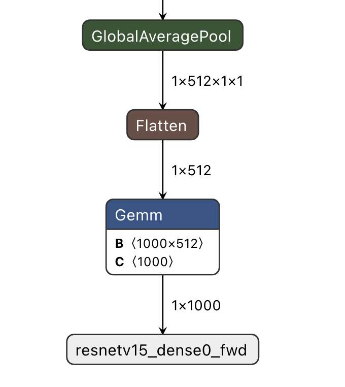

======================
Quick Start
======================

This section will cover in turn:

* How to install ``Docker`` on different system environments
* How to start a ``Docker`` container
* How to convert ``onnx`` models to ``joint`` models using the ``Pulsar Docker`` toolchain
* How to use ``joint`` models to run emulations on ``x86`` platforms
* How to measure the degree of difference between the inference results of ``joint`` and the inference results of ``onnx`` (internally called ``pairwise splitting``)

The onboard speed of the model mentioned in this section is based on the toolchain ``axera_neuwizard_v0.6.1.14.tar.gz`` compiled and generated, and is not used as a basis for actual performance evaluation.

.. note::

    The so-called ``pairwise splitting``, i.e., comparing the error between the inference results of different versions (file types) of the same model before and after the toolchain is compiled.

.. _dev_env_prepare:

--------------------------------------------
Development Environment Preparation
--------------------------------------------

This section describes the development environment preparation before using the ``Pulsar`` toolchain.

``Pulsar`` uses ``Docker`` containers for toolchain integration. Users can load ``Pulsar`` image files through ``Docker`` and then perform model conversion, compilation, simulation, etc. Therefore, the development environment preparation stage only requires the correct installation of the ``Docker`` environment. Supported systems ``MacOS``, ``Linux``, ``Windows``.

~~~~~~~~~~~~~~~~~~~~~~~~~~~~~~~~~~~~~~~~~~~~~~~~~~~~~~~~~~~~~~
Installing the Docker development environment
~~~~~~~~~~~~~~~~~~~~~~~~~~~~~~~~~~~~~~~~~~~~~~~~~~~~~~~~~~~~~~

- `MacOS Installing a Docker Environment <https://docs.docker.com/desktop/mac/install/>`_

- `Linux Installing a Docker Environment <https://docs.docker.com/engine/install/##server>`_

- `Windows install Docker environment <https://docs.docker.com/desktop/windows/install/>`_

After ``Docker`` is successfully installed, type ``sudo docker -v``

.. code-block:: shell

    $ sudo docker -v
    Docker version 20.10.7, build f0df350

If the above is displayed, it means ``Docker`` has been installed successfully. The following section describes the installation and startup of the ``Pulsar`` toolchain ``Image``.

~~~~~~~~~~~~~~~~~~~~~~~~~~~~~~~
Installing the Pulsar toolchain
~~~~~~~~~~~~~~~~~~~~~~~~~~~~~~~

The installation of the ``Pulsar`` toolchain is illustrated with the system version ``Ubuntu 18.04`` and the toolchain ``axera_neuwizard_v0.6.1.14.tar.gz``.
Toolchain access.

- `Obtain <https://wiki.sipeed.com/ai/zh/deploy/ax-pi.html#%E4%B8%8B%E8%BD%BD%E8%BD%AC%E6%8D%A2%E5%B7%A5%E5%85%B7>`_ from the AXera-Pi developer community.
- Released by AXera technical support after signing an NDA with them through the corporate channel.

^^^^^^^^^^^^^^^^^^^^^^^
Loading Docker Image
^^^^^^^^^^^^^^^^^^^^^^^

Unzip ``axera_neuwizard_v0.6.1.14.tar.gz`` and enter the ``axera_neuwizard_v0.6.1.14`` directory, run the ``install.sh`` script, and load the toolchain image file. The code example is as follows:

.. code-block:: shell

    $ tar -xvf axera_neuwizard_v0.6.1.14.tar.gz
    $ cd axera_neuwizard_v0.6.1.14
    $ ls .
    axera_neuwizard_0.6.1.14.tgz  install.sh  VERSION
    $ sudo ./install.sh

where ``install.sh`` is an executable script that loads the ``.tgz`` image file. Importing the image file correctly will print the following log:

.. code-block:: shell

    $ sudo ./install.sh
    0e4056611adc: Loading layer [==================================================]  243.7MB/243.7MB
    e4ff4d6a40b8: Loading layer [==================================================]   2.56kB/2.56kB
    a162c244071d: Loading layer [==================================================]  3.072kB/3.072kB
    564c200efe9b: Loading layer [==================================================]  4.608kB/4.608kB
    b945acdca3b6: Loading layer [==================================================]  6.144kB/6.144kB
    ee6ebe7bedc1: Loading layer [==================================================]   5.12kB/5.12kB
    45f02a0e56e2: Loading layer [==================================================]  2.048kB/2.048kB
    9758fe1f19bd: Loading layer [==================================================]   2.56kB/2.56kB
    Loaded image: axera/neuwizard:0.6.1.14

When finished, run ``sudo docker image ls``

.. code-block:: shell

    $ sudo docker image ls
    # Print the following data
    REPOSITORY TAG IMAGE ID CREATED SIZE
    axera/neuwizard 0.6.1.14 2124c702c879 3 weeks ago 3.24GB

You can see that the toolchain image has been loaded successfully, and you can start the container based on it.

^^^^^^^^^^^^^^^^^^^^^^^
Launch Toolchain Mirror
^^^^^^^^^^^^^^^^^^^^^^^

.. attention::

    The ``Pulsar`` toolchain is built on ``Docker`` containers and requires a high level of memory on the physical machine, usually at least ``32G`` or more is recommended, 
    If the memory is not enough during the model conversion, ``neuwizard killed by SIGKILL`` error may occur.

Execute the following command to start the ``Docker`` container, and enter the ``bash`` environment after a successful run

.. code-block:: shell

    $ sudo docker run --it --net host --rm --shm-size 32g -v $PWD:/data axera/neuwizard:0.6.1.14

The ``-shm-size`` parameter is recommended to be set to ``32g`` and above, and the ``-v`` parameter controls the mapping of the external folder to the internal folder of the container, for example ``$PWD:/data`` means the current folder is mapped to the ``/data`` folder in the container. 

.. _model_compile_and_sim:

----------------------------------------------------------------------------------------------------
Model compilation and simulation, as well as the description of the pair of scores
----------------------------------------------------------------------------------------------------

This section describes the basic operation of ``ONNX`` model conversion, using the ``pulsar`` tool to compile ``ONNX`` models into ``joint`` models. Please refer to the :ref:`Development Environment Preparation <dev_env_prepare>` section to complete the development environment. 
The example model in this section is the open source model ``ResNet18``.

~~~~~~~~~~~~~~~~~~~~~~~~~~~~~~~
Data preparation
~~~~~~~~~~~~~~~~~~~~~~~~~~~~~~~

.. hint::

    The model ``ResNet18`` and related dependencies for this section are provided in the ``quick_start_example`` folder `quick_start_example.zip Downloaded from <https://github.com/AXERA-TECH/ax-samples/releases/download/v0.3/quick_start_example.zip>`_ Then unzip the downloaded file and copy it to ``docker`` under the ``/data`` path.

After successfully starting the toolchain image, copy the five folders from ``quick_start_example.zip`` to the ``/data`` folder, and then execute

.. code-block:: shell

    root@xxx:/data# ls
    config dataset gt images model

The ``model`` folder holds the ``ONNX`` model files to be compiled, and the ``dataset`` holds the ``Calibration`` dataset for the ``PTQ`` (Post-Training Quantization) (the dataset is packaged in ``.tar`` format), 
The ``config`` folder is used to store the configuration files needed to compile the model, ``gt`` is used to store the results of the simulation runs, and ``images`` is used to store the test images.

After the data preparation, the directory tree structure is as follows:

.. code-block:: shell

    root@xxx:/data# tree
    .
    ├── config
    │   └── config_resnet18.prototxt
    ├── dataset
    │   └── imagenet-1k-images.tar
    ├── gt
    ├── images
    │   ├── cat.jpg
    │   ├── img-319.jpg
    │   ├── img-416.jpg
    │   └── img-642.jpg
    └── model
        └── resnet18.onnx

.. hint::

    The ``tree`` command is not pre-installed in the toolchain ``docker``, and can be viewed outside of ``docker``.

~~~~~~~~~~~~~~~~~~~~~~~~~~~~~~~
Command description
~~~~~~~~~~~~~~~~~~~~~~~~~~~~~~~

The functional commands in the ``Pulsar`` toolchain start with ``pulsar``, and the user-strong related commands are ``pulsar build`` , ```pulsar run`` and ``pulsar version``. 

* ``pulsar build`` is used to convert ``onnx`` models to ``joint`` format models
* ``pulsar run`` is used for ``joint`` validation before and after model conversion
* ``pulsar version`` can be used to see the current version of the toolchain, which is usually required for feedback issues

.. code-block:: shell

    root@xxx:/data# pulsar --help
    usage: pulsar [-h] {debug,build,version,info,run,view} ...

    positional arguments:
    {debug,build,version,info,run,view}
        debug               score compare debug tool
        build               from onnx to joint
        version             version info
        info                brief model
        run                 simulate models
        view                neuglass to visualize mermaids

    optional arguments:
    -h, --help            show this help message and exit

~~~~~~~~~~~~~~~~~~~~~~~~~~~~~~~
Configuration file description
~~~~~~~~~~~~~~~~~~~~~~~~~~~~~~~

``config_resnet18.prototxt`` under the ``/data/config/`` path Show:

.. code-block:: shell

    # Basic configuration parameters: input and output
    input_type: INPUT_TYPE_ONNX
    output_type: OUTPUT_TYPE_JOINT

    # Hardware platform selection
    target_hardware: TARGET_HARDWARE_AX620

    # CPU backend selection, default is AXE
    cpu_backend_settings {
        onnx_setting {
            mode: DISABLED
        }
        axe_setting {
            mode: ENABLED
            axe_param {
                optimize_slim_model: true
            }
        }
    }

    # Model input data type settings
    src_input_tensors {
        color_space: TENSOR_COLOR_SPACE_RGB
    }

    dst_input_tensors {
        color_space: TENSOR_COLOR_SPACE_RGB
        # color_space: TENSOR_COLOR_SPACE_NV12 # If the input data is NV12, then this configuration is used
    }

    # Configuration parameters for the neuwizard tool
    neuwizard_conf {
        operator_conf {
            input_conf_items {
                attributes {
                    input_modifications {
                        affine_preprocess {
                            slope: 1
                            slope_divisor: 255
                            bias: 0
                        }
                    }
                    input_modifications {
                        input_normalization {
                            mean: [0.485,0.456,0.406]  ## mean
                            std: [0.229,0.224,0.255]   ## std
                        }
                    }
                }
            }
        }
        dataset_conf_calibration {
            path: "... /dataset/imagenet-1k-images.tar" # Set the path to the PTQ calibration dataset
            type: DATASET_TYPE_TAR # dataset type: tarball
            size: 256 # The actual number of images used in the quantitative calibration process
            batch_size: 1
        batch_size: 1}

        dataset_conf_error_measurement {
            path: "... /dataset/imagenet-1k-images.tar"
            type: DATASET_TYPE_TAR # Dataset type: tarball
            size: 4 # The actual number of images used in the layer-by-layer pairing process
        }

        evaluation_conf {
            path: "neuwizard.evaluator.error_measure_evaluator"
            type: EVALUATION_TYPE_ERROR_MEASURE
            source_ir_types: IR_TYPE_ONNX
            ir_types: IR_TYPE_LAVA
            score_compare_per_layer: true
        }  
    }

    # Output layout settings, NHWC is recommended for faster speed
    dst_output_tensors {
        tensor_layout:NHWC
    tensor_layout:NHWC }

    # configuration parameters for pulsar compiler
    pulsar_conf {
        ax620_virtual_npu: AX620_VIRTUAL_NPU_MODE_111 # business scenario requires the use of ISP, then the vNPU 111 configuration must be used, 1.8Tops arithmetic power to the user's algorithm model
        batch_size: 1
        debug : false
    }

~~~~~~~~~~~~~~~~~~~~~~~~~~~~~~~
Model Compilation
~~~~~~~~~~~~~~~~~~~~~~~~~~~~~~~

Take ``resnet18.onnx`` as an example, execute the following ``pulsar build`` command in ``docker`` to compile ``resnet18.joint``:

.. code-block:: shell

    # Model conversion commands, which can be copied and run directly
    pulsar build --input model/resnet18.onnx --output model/resnet18.joint --config config/config_resnet18.prototxt --output_config config/output_config.prototxt


**log reference information**

.. code-block:: python

    root@662f34d56557:/data# pulsar build --input model/resnet18.onnx --output model/resnet18.joint --config config/config_resnet18.prototxt --output_config config/output_config.prototxt

    [W Context.cpp:69] Warning: torch.set_deterministic is in beta, and its design and  functionality may change in the future. (function operator())
    [09 06:46:16 frozen super_pulsar.proto.configuration_super_pulsar_manip:229] set task task_0's pulsar_conf.output_dir as /data
    [09 06:46:17 frozen super_pulsar.func_wrappers.wrapper_pulsar_build:28] planning task task_0
    [09 06:46:17 frozen super_pulsar.func_wrappers.wrapper_pulsar_build:334] #################################### Running task task_0 ####################################
    [09 06:46:17 frozen super_pulsar.toolchain_wrappers.wrapper_neuwizard:31] python3 /root/python_modules/super_pulsar/super_pulsar/toolchain_wrappers/wrapper_neuwizard.py --config /tmp/tmpa18v1l0m.prototxt
    [09 06:53:25 frozen super_pulsar.toolchain_wrappers.wrapper_neuwizard:37] DBG [neuwizard] ONNX Model Version 7 for "/data/model/resnet18.onnx"
    ... ...
    [09 07:10:33 frozen super_pulsar.toolchain_wrappers.wrapper_toolchain:482] File saved: /data/model/resnet18.joint
    [09 07:10:33 frozen super_pulsar.toolchain_wrappers.wrapper_toolchain:489] DBG cleared /root/tmpxd2caw3b

.. attention::

    ``resnet18.onnx`` model in hardware configuration of:

        - Intel(R) Xeon(R) Gold 6130 CPU @ 2.10GHz
        - Memory 32G

    The conversion time on a server with Intel(R) Xeon(R) Gold 6130 CPU @ 2.10GHz Memory 32G is about ``3min``, which may vary from machine to machine, so be patient.

~~~~~~~~~~~~~~~~~~~~~~~~~~~~~~~
Upper board speed measurement
~~~~~~~~~~~~~~~~~~~~~~~~~~~~~~~

The ``resnet18.joint`` model generated during the ``pulsar build`` phase can be speed tested on the community board ``AX-Pi <https://item.taobao.com/item.htm?_u=m226ocm5e25&id=682169792430>`_ or the official EVB using the ``run_joint`` command, as follows:

- First connect to the **AX-Pi** via ``ssh`` or ``serial communication``.

- Then copy or mount the ``resnet18.joint`` model to any folder on the development board.

- Finally execute the command ``run_joint resnet18.joint --repeat 100 --warmup 10``

**Resnet18 speed log example**

.. code-block:: bash

    $ run_joint resnet18.joint --repeat 100 --warmup 10
    run joint version: 0.5.10

    virtual npu mode is 1_1

    tools version: 0.6.1.4
    59588c54
    Using wbt 0
    Max Batch Size 1
    Support Dynamic Batch? No
    Is FilterMode? No

    Quantization Type is 8 bit

    Input[0]: data
        Shape [1, 224, 224, 3] NHWC uint8 RGB
        Memory Physical
        Size 150528
    Output[0]: resnetv15_dense0_fwd
        Shape [1, 1000] NHWC float32
        Memory Physical
        Size 4000

    Using batch size 1
    input[0] data data not provided, using random data

    Not set environment variable to report memory usage!

    CMM usage: 13761984

    Create handle took 569.69 ms (neu 10.77 ms, onnx 0.00 ms, axe 0.00 ms, overhead 558.93 ms)
    Run task took 5415 us (99 rounds for average)
            Run NEU took an average of 5378 us (overhead 10 us)

    NPU perf cnt total: 4190383
            NPU perf cnt of eu(0): 2543447
            NPU perf cnt of eu(1): 0
            NPU perf cnt of eu(2): 0
            NPU perf cnt of eu(3): 2645657
            NPU perf cnt of eu(4): 0

.. hint::

    In the above log, the ``NPU`` inference time for ``resnet18`` is ``5.415ms`` (the ``NEU`` file is executed on the ``NPU``), no ``CPU`` time is consumed, ``overhead`` is the time used for model decompression, parsing, loading and memory allocation, which is initialized only once and can be ignored in real applications.

In some cases, the transformed model will contain a ``CPU tail`` (a ``DAG`` subgraph running on the ``CPU`` that ends in ``.onnx`` or ``.axe``), and an example of a model speed log with a ``CPU`` tail is shown below:

.. code-block:: bash

    $ run_joint resnet50.joint --repeat 100 --warmup 10
    run joint version: 0.5.13

    virtual npu mode is 1_1
    tools version: 0.5.34.2
    7ca3b9d5
    Using wbt 0
    Max Batch Size 1
    Support Dynamic Batch? No
    Is FilterMode? No

    Quantization Type is unknown

    Input[0]: data
        Shape [1, 224, 224, 3] NHWC uint8 BGR
        Memory Physical
        Size 150528
    Output[0]: resnetv24_dense0_fwd
        Shape [1, 1000] NCHW float32
        Memory Virtual
        Size 4000

    Using batch size 1
    input[0] data data not provided, using random data

    Create handle took 1830.94 ms (neu 44.76 ms, onnx 0.00 ms, axe 13.89 ms, overhead 1772.28 ms)
    Run task took 32744 us (99 rounds for average)
        Run NEU took an average of 32626 us (overhead 22 us)
        Run AXE took an average of 43 us (overhead 4 us)

From the above example, we can see that ``NPU`` inference time is ``32.626ms``, ``CPU`` time is ``43us``, and the total time of model inference is the sum of ``NPU`` time and ``CPU`` time, which is ``32.744ms``.
(P.S.: The network structure of resnet50 in this example has been modified to demonstrate the functionality of the heterogeneous cut map, and is not used as a reference for resnet50 speed evaluation)

**run_joint command description**

.. code-block:: bash

    $ run_joint -h
    undefined short option: -h
    usage: run_joint [options] ... joint-file
    options:
        --mode                   NPU mode, disable for no virtual npu; 1_1 for AX_NPU_VIRTUAL_1_1 (string [=])
    -d, --data                   The format is file0;file1... to specify data files for input vars.
        'file*' would be directly loaded in binary format to tensor in order (string [=])
        --bin-out-dir            Dump output tensors in binary format (string [=])
        --repeat                 Repeat times for inference (int [=1])
        --warmup                 Repeat times for warmup (int [=0])
        --stride_w               mock input data with extra width stride (int [=0])
        --override_batch_size    override batch size for dynamic batch model (int [=0])
        --wbt_index              select WBT for inference (int [=0])
    -p, --manual_alloc           manually alloc buffer with ax sys api instead of joint api
    -t, --enable_trunc           truncate input data size to model required size when using a larger input data, experimental function, will be removed in future release
        --cache-mode             'CACHED' means use only cached CMM memory; 'NONE-CACHED' means use only none-cached CMM memory; 'SMART_CACHED' means use cached and none-cached CMM memory in turn (string [=CACHED])
    -?, --help                   print this message

.. _pulsar_run_sim:

~~~~~~~~~~~~~~~~~~~~~~~~~~~~~~~~~~~~~~~~~~~~~~~~~~~~~~~~~~~~~~
x86 emulation run and pair splitting instructions
~~~~~~~~~~~~~~~~~~~~~~~~~~~~~~~~~~~~~~~~~~~~~~~~~~~~~~~~~~~~~~

.. attention::

    Note, this section is based on the toolchain ``axera_neuwizard_v0.6.1.14``, which is available in different versions, 
    The command parameters may be different in different versions, so use the ``pulsar run -h`` command to see the list of command input parameters. Other commands can be used to view the argument list in the same way.

Executing the ``pulsar run`` command in ``docker`` gives you the inference results of the ``onnx`` and ``joint`` models and the degree of difference between the model outputs:

.. code-block:: shell

    # Model emulation and pair splitting instructions, can be directly copied and run
    pulsar run model/resnet18.onnx model/resnet18.joint --input images/img-319.jpg --config config/output_config.prototxt --output_gt gt/

**log information reference**

.. code-block:: shell

    root@662f34d56557:/data# pulsar run model/resnet18.onnx model/resnet18.joint --input images/img-319.jpg --config config/output_config.prototxt --output_gt gt/

    ...
    ...
    [26 07:14:45 <frozen super_pulsar.func_wrappers.wrapper_pulsar_run>:138] =========================

    [26 07:14:45 <frozen super_pulsar.func_wrappers.pulsar_run.utils>:70] dumpped 'resnetv15_dense0_fwd' to 'gt/joint/resnetv15_dense0_fwd.bin'.
    [26 07:14:45 <frozen super_pulsar.func_wrappers.pulsar_run.compare>:97] ###### Comparing resnet18.onnx (with conf) and resnet18.joint ######
    [26 07:14:45 <frozen super_pulsar.func_wrappers.pulsar_run.compare>:82] Score compare table:
    ---------------------------  ----------------  ------------------
    Layer: resnetv15_dense0_fwd  2-norm RE: 4.70%  cosine-sim: 0.9989

The ``layer_name``, L2 regularization and cosine similarity of the model output can be obtained from the output log. The cosine similarity (cosine-sim) results provide a visualization of the loss of model accuracy (essentially comparing the difference between the inference results of the ``onnx`` and ``joint`` models).

^^^^^^^^^^^^^^^^^^^^^^^^^^^^^^^^^^^^
Output file description
^^^^^^^^^^^^^^^^^^^^^^^^^^^^^^^^^^^^

A description of the file generated after executing the ``pulsar build`` and ``pulsar run`` commands:

.. code-block:: shell

    root@xxx:/data# tree

    .
    ├── config
    │   ├── config_resnet18.prototxt  # Model compilation configuration file
    │   └── output_config.prototxt    # pulsar run required configuration files
    ├── dataset
    │   └── imagenet-1k-images.tar    # Calibration data set
    ├── gt                            # Input data that can be used to run the demo on the board
    │   ├── input
    │   │   ├── data.bin
    │   │   ├── data.npy
    │   │   └── filename.txt
    │   ├── joint                     # output data from joint model simulation runs
    │   │   ├── resnetv15_dense0_fwd.bin
    │   │   └── resnetv15_dense0_fwd.npy
    │   └── onnx                      # Output data from the onnx model simulation run
    │       ├── resnetv15_dense0_fwd.bin
    │       └── resnetv15_dense0_fwd.npy
    ├── images                        # Test images
    │   ├── cat.jpg
    │   ├── img-319.jpg
    │   ├── img-416.jpg
    │   └── img-642.jpg
    ├── inference_report
    │   └── part_0.lava
    │       ├── inference_report.log
    │       ├── subgraph_0
    │       │   └── inference_report.log
    │       └── subgraph_1
    │           └── inference_report.log
    └── model
        ├── model.lava_joint
        ├── resnet18.joint            # Compile-generated Joint model
        └── resnet18.onnx             # Original ONNX model

    12 directories, 20 files

.. hint::

    The ``gt`` folder of the ``pulsar run`` output holds the simulation inference results for the ``onnx`` and ``joint`` models, which can be used to manually map (between the ``joint`` simulation results on the ``x86`` platform and the onboard output) and parse the output of the ``joint`` models.

^^^^^^^^^^^^^^^^^^^^^^^^^^^^^^^^^^^^^^^^^^^^^^^^^^^^^^^^^^^^^^^^^^^^^^^^
Parsing the inference results of the ``joint`` model
^^^^^^^^^^^^^^^^^^^^^^^^^^^^^^^^^^^^^^^^^^^^^^^^^^^^^^^^^^^^^^^^^^^^^^^^

The ``gt`` file tree is as follows:

.. code-block:: bash

    $ tree gt
    gt
    ├── input  # input data for onnx and joint models
    │   ├── data.bin
    │   ├── data.npy
    │   └── filename.txt
    ├── joint  # Inference results for the joint model
    │   ├── resnetv15_dense0_fwd.bin
    │   └── resnetv15_dense0_fwd.npy
    └── onnx  # Inference results for the onnx model
        ├── resnetv15_dense0_fwd.bin
        └── resnetv15_dense0_fwd.npy

    3 directories, 7 files

* The input data of the model is given in the ``input`` folder, in two forms: ``.bin`` and ``.npy``, containing the same data information.
* The inference results of the model are given in the ``onnx`` and ``joint`` folders, respectively, and the output of the model can be processed to meet different needs.

The following is an example of how to process the inference results of ``resnet18`` model, which has the following output structure:



The sample code (``parse_gt.py``) for outputting the classification result with shape (1, 1000) is as follows:

.. code-block:: bash

    #!/usr/bin/env python3
    import math
    import numpy as np
    import json
    import logging


    # Note: The sample code is based on the resnet18 model, other models can be modified as appropriate
    if __name__ == '__main__':
        import argparse
        parser = argparse.ArgumentParser()
        parser.add_argument(dest='npy', nargs="+", help='pulsar run, gt, npy file')
        parser.add_argument('--K', type=int, default=5, help='top k')
        parser.add_argument('--rtol', type=float, default=1e-2, help='relative tolerance')
        parser.add_argument('--atol', type=float, default=1e-2, help='absolute tolerance')
        args = parser.parse_args()

        assert len(args.npy) <= 2
        with open('./imagenet1000_clsidx_to_labels.json', 'r') as f:
            # imagenet1000_clsidx_to_labels: https://gist.github.com/yrevar/942d3a0ac09ec9e5eb3a
            js = f.read()
            imgnet1000_clsidx_dict = json.loads(js)
        
        for npy in args.npy:
            result = np.load(npy)
            indices = (-result[0]).argsort()[:args.K]
            logging.warning(f"{npy}, imagenet 1000 class index, top{args.K} result is {indices}")
            
            for idx in indices:
                logging.warning(f"idx: {idx}, classification result: {imgnet1000_clsidx_dict[str(idx)]}")
        
        if len(args.npy) == 2:  # Pair the two npy's, no output, then the pairing is successful
            npy1 = np.load(args.npy[0])
            npy2 = np.load(args.npy[1])
            assert not math.isnan(npy1.sum()) and not math.isnan(npy2.sum())
            try:
                if npy1.dtype == np.float32:
                    assert np.allclose(npy1, npy2, rtol=args.rtol, atol=args.atol), "mismatch {}".format(abs(npy1 - npy2).max())
                else:
                    assert np.all(npy1 == npy2), "mismatch {}".format(abs(npy1 - npy2).max())
            except AssertionError:
                logging.warning("abs(npy1 - npy2).max() = ", abs(npy1 - npy2).max())

By executing the following commands

.. code-block:: bash

     python3 parse_gt.py  gt/onnx/resnetv15_dense0_fwd.npy gt/joint/resnetv15_dense0_fwd.npy --atol 100000 --rtol 0.000001

Example of output results:

.. code-block:: python

    WARNING:root:gt/onnx/resnetv15_dense0_fwd.npy, imagenet 1000 class index, top5 result is [924 948 964 935 910]
    WARNING:root:idx: 924, classification result: guacamole
    WARNING:root:idx: 948, classification result: Granny Smith
    WARNING:root:idx: 964, classification result: potpie
    WARNING:root:idx: 935, classification result: mashed potato
    WARNING:root:idx: 910, classification result: wooden spoon
    
    WARNING:root:gt/joint/resnetv15_dense0_fwd.npy, imagenet 1000 class index, top5 result is [924 948 935 964 910]
    WARNING:root:idx: 924, classification result: guacamole
    WARNING:root:idx: 948, classification result: Granny Smith
    WARNING:root:idx: 935, classification result: mashed potato
    WARNING:root:idx: 964, classification result: potpie
    WARNING:root:idx: 910, classification result: wooden spoon

.. hint::

    ``parse_gt.py`` supports parsing two ``npy``. If no parsing log is output after execution, the parsing is successful.

.. _pulsar_run_gt_compare:

^^^^^^^^^^^^^^^^^^^^^^^^^^^^^^^^^^^^^^^^^^^^^^^^^^^^^^^^^^^^^^^^^^^^^^^^
Instructions for ``gt`` file splitting
^^^^^^^^^^^^^^^^^^^^^^^^^^^^^^^^^^^^^^^^^^^^^^^^^^^^^^^^^^^^^^^^^^^^^^^^

.. hint::

    Manual bisection is generally not necessary, and the loss of model accuracy can be easily observed by observing ``cosine-sim`` with ``pulsar run``.

Manual alignment requires building the alignment script manually, as described below:

.. code-block:: bash

  # Create the script file used for the score

  $ vim compare_fp32.py

``compare_fp32.py`` reads as follows:

.. code-block:: python

  #!/usr/bin/env python3
  import math
  import numpy as np

  if __name__ == '__main__':
      import argparse
      parser = argparse.ArgumentParser()
      parser.add_argument(dest='bin1', help='bin file as fp32')
      parser.add_argument(dest='bin2', help='bin file as fp32')
      parser.add_argument('--rtol', type=float, default=1e-2,
                          help='relative tolerance')
      parser.add_argument('--atol', type=float, default=1e-2,
                          help='absolute tolerance')
      parser.add_argument('--report', action='store_true', help='report for CI')
      args = parser.parse_args()

      try:
          a = np.fromfile(args.bin1, dtype=np.float32)
          b = np.fromfile(args.bin2, dtype=np.float32)
          assert not math.isnan(a.sum()) and not math.isnan(b.sum())
      except:
          a = np.fromfile(args.bin1, dtype=np.uint8)
          b = np.fromfile(args.bin2, dtype=np.uint8)
      try:
          if a.dtype == np.float32:
              assert np.allclose(a, b, rtol=args.rtol, atol=args.atol), "mismatch {}".format(abs(a - b).max())
          else:
              assert np.all(a == b), "mismatch {}".format(abs(a - b).max())
          if args.report:
              print(0)
      except AssertionError:
          if not args.report:
              raise
          else:
              print(abs(a - b).max())

After the script is created successfully, execute the following command to get the ``joint`` model results in the actual board:

.. code-block:: bash

  run_joint resnet18.joint --data gt/input/data.bin --bin-out-dir out/ --repeat 100

The ``joint`` upboarding results are saved in the ``out`` folder.

.. code-block:: bash

  $ python3 compare_fp32.py --atol 100000 --rtol 0.000001 gt/joint/resnetv24_dense0_fwd.bin out/resnetv24_dense0_fwd.bin

After executing the command, no result is returned, which means the pairing is successful.

.. _onboard_running:

--------------------------------------------
Development board running
--------------------------------------------

This section describes how to run the ``resnet18.joint`` model on the ``AX-Pi`` development board, obtained via the :ref:`Model Compile Simulation <model_compile_and_sim>` section. 
The example shows how a classification network can classify an input image, but more specifically, for example, the source code of the open source project `ax-samples <https://github.com/AXERA-TECH/ax-samples>`_ is compiled to generate an executable For other examples (object detection, image segmentation, human keypoints, etc.), please refer to the :ref:`Detailed description of model deployment <model_deploy_advanced>` section.

~~~~~~~~~~~~~~~~~~~~~~~~~~~~~~~
Development Board Acquisition
~~~~~~~~~~~~~~~~~~~~~~~~~~~~~~~

- Acquired through **AX-Pi** designated Taobao Mall (`Purchase link <https://item.taobao.com/item.htm?_u=m226ocm5e25&id=682169792430>`_);
- Get **EVB** after signing the NDA with AXera through the corporate channel.

~~~~~~~~~~~~~~~~~~~~~~~~~~~~~~~~~~~~~~~~~~~~~~~~~~~~~~~~~~~~~~
Data preparation for onboard operation
~~~~~~~~~~~~~~~~~~~~~~~~~~~~~~~~~~~~~~~~~~~~~~~~~~~~~~~~~~~~~~

.. hint::

    The upper board runtime example has been packaged in the ``demo_onboard`` folder `demo_onboard.zip download link <https://github.com/AXERA-TECH/ax-samples/releases/download/v0.3/demo_onboard.zip>`_
    Extract the downloaded file, where ``ax_classification`` is the pre-cross-compiled classification model executable that can be run on the ``AX-Pi`` development board. 
    ``resnet18.joint`` is the compiled classification model, and ``cat.jpg`` is the test image.

Copy ``ax_classification``, ``resnet18.joint``, and ``cat.png`` to the board, and if ``ax_classification`` lacks executable permissions, you can add them with the following command

.. code-block:: shell

    /root/sample # chmod a+x ax_classification  # Add execution rights
    /root/sample # ls -l
    total 15344
    -rwxrwxr-x    1 1000     1000       3806352 Jul 26 15:22 ax_classification
    -rw-rw-r--    1 1000     1000        140391 Jul 26 15:22 cat.jpg
    -rw-rw-r--    1 1000     1000      11755885 Jul 26 15:22 resnet18.joint

~~~~~~~~~~~~~~~~~~~~~~~~~~~~~~~~~~~~~~~~~~~~~~~~~~~~~~~~~~~~~~~~~~~~~~~~
Run ``Resnet18`` classification model on the board
~~~~~~~~~~~~~~~~~~~~~~~~~~~~~~~~~~~~~~~~~~~~~~~~~~~~~~~~~~~~~~~~~~~~~~~~

``ax_classification`` Input parameter description: 

.. code-block:: shell

    /root/sample # ./ax_classification --help
    usage: ./ax_classification --model=string --image=string [options] ...
    options:
    -m, --model     joint file(a.k.a. joint model) (string)
    -i, --image     image file (string)
    -g, --size      input_h, input_w (string [=224,224])
    -r, --repeat    repeat count (int [=1])
    -?, --help      print this message

The classification model is implemented on the board by executing the ``ax_classification`` program, and the results are as follows:

.. code-block:: shell

    /root/sample # ./ax_classification -m resnet18.joint -i cat.png -r 100
    --------------------------------------
    model file : resnet18.joint
    image file : cat.jpg
    img_h, img_w : 224 224
    Run-Joint Runtime version: 0.5.10
    --------------------------------------
    [INFO]: Virtual npu mode is 1_1

    Tools version: 0.6.1.4
    59588c54
    11.4611, 285
    10.0656, 278
    9.8469, 287
    9.0733, 282
    9.0031, 279
    --------------------------------------
    Create handle took 570.64 ms (neu 10.89 ms, axe 0.00 ms, overhead 559.75 ms)
    --------------------------------------
    Repeat 100 times, avg time 5.42 ms, max_time 5.81 ms, min_time 5.40 ms
